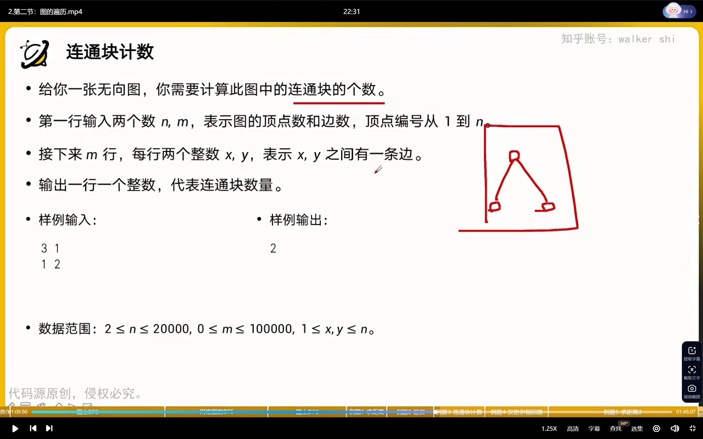
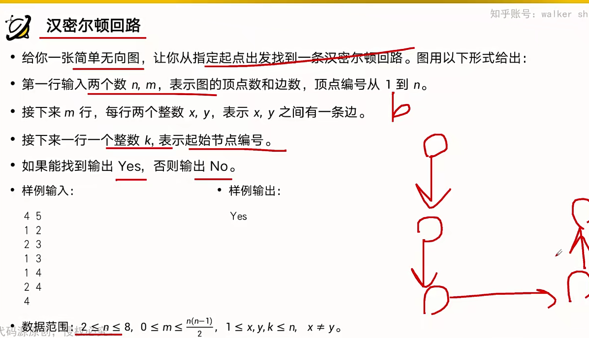
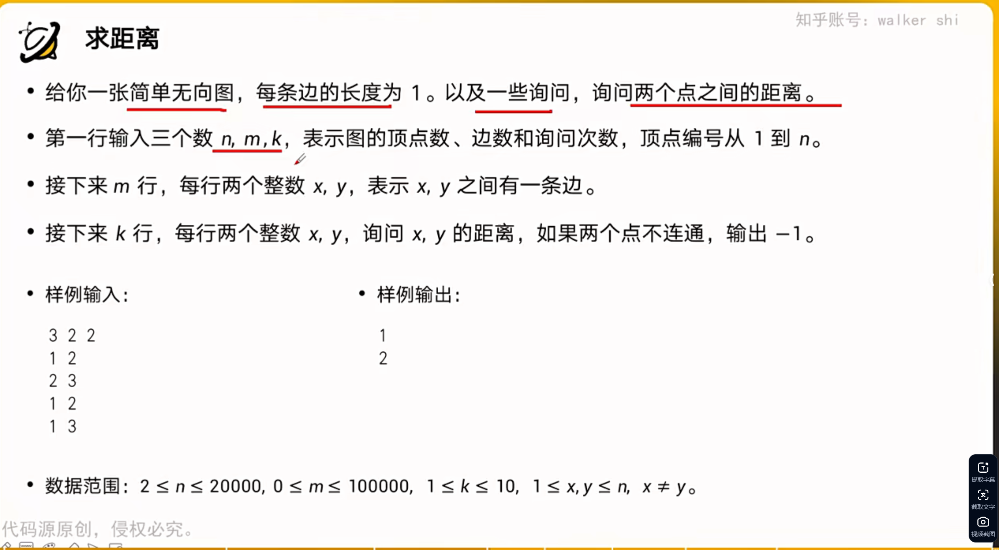
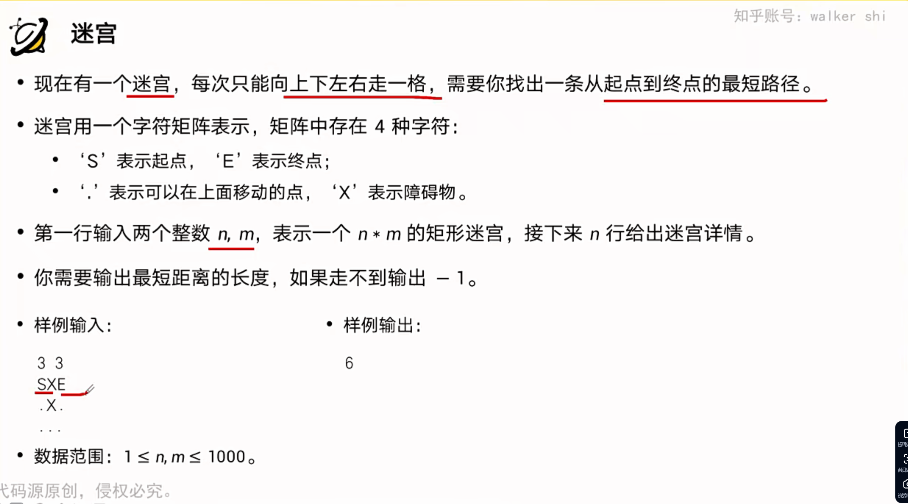
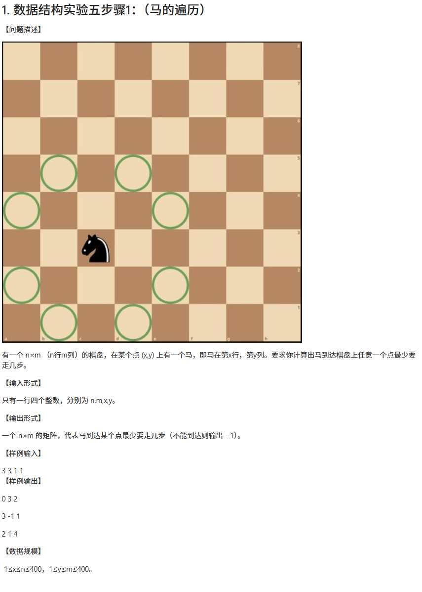
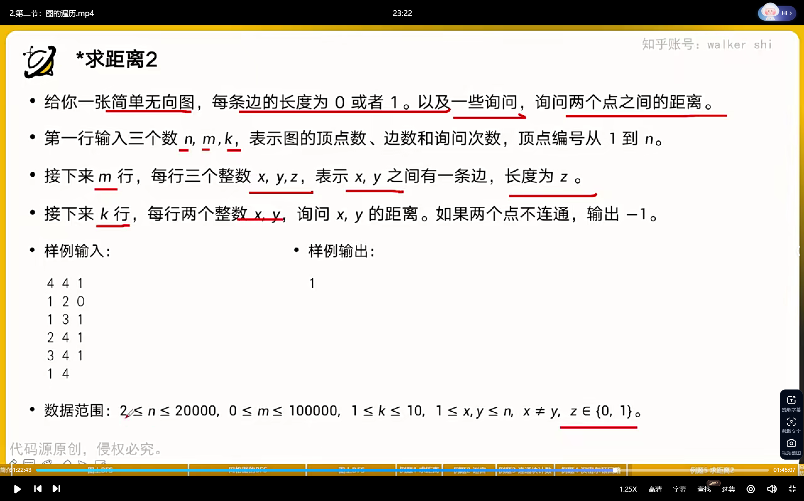

# DFS

## 数的全排列

```cpp
#include<bits/stdc++.h>

using namespace std;

const int N = 10;
int n;
int path[N];
bool st[N];

void dfs(int u){
  if(u==n)  {
    for (int i = 0;i<n;i++)  printf("%d ",path[i]);
    puts("");
    return;
  }
  for (int i = 1; i <= n;i++){
    if(!st[i]){
      path[u]=i;
      st[i]=true;
      dfs(u+1);
      st[i] = false;
    }
  }
}
int main(){
  cin >> n;

  dfs(0);
  return 0;
}
```

## n皇后

```cpp
#include <bits/stdc++.h>

using namespace std;

const int N = 20;

int n;
char g[N][N];
bool col[N], dg[N], udg[N];

void dfs(int u)
{
  if (u == n)
  {
    for (int i = 0; i < n; i++)
      puts(g[i]);
    puts("");
    return;
  }
  for (int i = 0; i < n; i++)
  {
    if (!col[i] && !dg[u + i] && !udg[n - u + i])//加n防止数组越界
    {
      g[u][i] = 'Q';
      col[i] = dg[u + i] = udg[n - u + i] = true;
      dfs(u + 1);
      g[u][i] = '.';
      col[i] = dg[u + i] = udg[n - u + i] = false;
    }
  }
}

int main()
{
  cin >> n;
  for (int i = 0; i < n; i++)
    for (int j = 0; j < n; j++)
      g[i][j] = '.';
  dfs(0);

  return 0;
}
```

**思路二**

```cpp
#include <bits/stdc++.h>

using namespace std;

const int N = 20;

int n;
char g[N][N];
bool  row[N],col[N], dg[N], udg[N];

void dfs(int x, int y, int s){//s是皇后数量
  if(y==n)  y=0,x++;
  if(x==n){
    if(s==n){
      for (int i = 0;i<n;i++)  puts(g[i]);
      puts("");
    }
    return;
  }
   //不放皇后
  dfs(x, y + 1, s);

  //放皇后
  if(!row[x] && !col[y] && !dg[x+y] &&!udg[x-y+n]){
    g[x][y]='Q';
    row[x]=col[y]=dg[x+y]=udg[x-y+n]=true;
    dfs(x, y + 1, s + 1);
    row[x] = col[y] = dg[x + y] = udg[x - y + n] = false;
    g[x][y] = '.';
  }
}


int main()
{
  cin >> n;
  for (int i = 0; i < n; i++)
    for (int j = 0; j < n; j++)
      g[i][j] = '.';

  dfs(0, 0, 0);
  return 0;
}
```


## 树的重心

```cpp
#include <bits/stdc++.h>

using namespace std;
const int N = 100010;
vector<int> edge[N];

int n;
int ans = N;
bool st[N];

int dfs(int u)
{
    st[u] = true;
    int sum = 1, res = 0;//不能定义为全局变量
    for (auto k : edge[u])
    {
        if (!st[k])
        {
            int s = dfs(k);
            res = max(res, s);
            sum += s;
        }
    }

    res = max(n - sum, res);
    ans = min(ans, res);
    return sum;
}

int main()
{
    cin >> n;
    for (int i = 1; i < n; i++)
    {
        int x, y;
        cin >> x >> y;
        edge[x].push_back(y);
        edge[y].push_back(x);
    }
    dfs(1);
    cout << ans;
}
/*
9
1 2
1 7
1 4
2 8
2 5
4 3
3 9
4 6
输出
4

*/
```




### 连通块计数

```cpp
#include <bits/stdc++.h>

using namespace std;

int n,m;
vector<int > edge[20001];
bool b[20001];

inline void dfs(int x){
        b[x]=true;
        for(auto y:edge[x]){
            if(!b[y]){
                dfs(y);
            }
        }
}

int main(){
    scanf("%d%d",&n,&m);
    for(int i=1;i<=m;i++){
        int x,y;
        scanf("%d%d",&x,&y);
        edge[x].push_back(y);
        edge[y].push_back(x);
    }
    int cnt = 0;
    memset(b,false,sizeof(b));
    for(int i=1;i<=n;i++){
        if(!b[i]){
            dfs(i);
            cnt++;
        }
    }
    printf("%d", cnt);
}

```



### 哈密顿回路

```cpp
#include <bits/stdc++.h>

using namespace std;

int n,m,k;
vector<int> edge[30];
bool b[9];

bool dfs(int x,int c){
    if(c==n&&x==k) return true;
    for(auto i:edge[x]){
        if(!b[i]){
            b[i]=true;
            if(dfs(i,c+1))
                return true;
            b[i] = false;
        }
    }
    return false;
}

int main(){
    scanf("%d%d",&n,&m);
    for (int i = 1;i<=m;i++){
        int x,y;
        scanf("%d%d",&x,&y);
        edge[x].push_back(y);
        edge[y].push_back(x);
    }
    scanf("%d", &k);
    if(dfs(k,0))
        printf("Yes");
    else
        printf("No");

}
/*
4 5
1 2
2 3
1 3
1 4
2 4
4
*/
```


# BFS

## 迷宫

```cpp
#include <bits/stdc++.h>

using namespace std;
typedef pair<int, int> PII;

const int N = 110;
int D[4][2] = {{-1, 0}, {1, 0}, {0, -1}, {0, 1}};
int n, m;
int g[N][N], dis[N][N];
queue<PII> q;
PII Prev[N][N];
void bfs()
{
    q.push({1, 1});
    memset(dis, -1, sizeof(dis));
    dis[1][1] = 0;

    while (!q.empty())
    {
        auto x = q.front();
        q.pop();
        for (int i = 0; i < 4; i++)
        {
            int xx = x.first + D[i][0], yy = x.second + D[i][1];
            if (xx <= n && xx >= 1 && yy <= m && yy >= 1 && g[xx][yy] == 0 && dis[xx][yy] == -1)
            {
                dis[xx][yy] = dis[x.first][x.second] + 1;
                Prev[xx][yy] = x;
                q.push({xx, yy});
            }
        }
    }
    int x=n,y=m;//路径输出
    while(x||y){
        cout << x << " " << y <<endl;
        auto t=Prev[x][y];
        x = t.first, y = t.second;
    }
}

int main()
{
    ios::sync_with_stdio(false), cin.tie(0);
    cin >> n >> m;
    for (int i = 1; i <= n; i++)
    {
        for (int j = 1; j <= m; j++)
        {
            cin >> g[i][j];
        }
    }
    bfs();
    cout << dis[n][m] << endl;
}

/*
5 5
0 1 0 0 0
0 1 0 1 0
0 0 0 0 0
0 1 1 1 0
0 0 0 1 0

输出
5 5
4 5
3 5
3 4
3 3
3 2
3 1
2 1
1 1
8


*/
```

## 求点1到点n的距离

```cpp
#include <bits/stdc++.h>

using namespace std;
const int N = 100010;

int n, m, d[N];
vector<int> edge[N];
queue<int> q;
int bfs()
{
    memset(d, -1, sizeof(d));
    q.push(1);
    d[1] = 0;
    while (!q.empty())
    {
        int x = q.front();
        q.pop();
        for (auto k : edge[x])
        {
            if (d[k] == -1)
            {
                d[k] = d[x] + 1;
                q.push(k);
            }
        }
    }
    return d[n];
}

int main()
{
    cin >> n >> m;
    for (int i = 1; i <= m; i++)
    {
        int x, y;
        cin >> x >> y;
        edge[x].push_back(y);
    }
    cout << bfs() << endl;
}

/*
4 5
1 2
2 3
3 4
1 3
1 4

输出
1
*/
```

## 八数码

```cpp
#include <bits/stdc++.h>

using namespace std;

int bfs(string start){
    string end="12345678x";
    queue<string> q;
    unordered_map<string, int> d;
    q.push(start);
    d[start]=0;

    int dx[4] = {-1, 0, 1, 0}, dy[4] = {0, 1, 0, -1};

    while(q.size()){
        auto t=q.front();
        q.pop();

        int distance=d[t];

        if(end==t)  return distance;
        
        int k=t.find('x');
        int x = k / 3, y = k % 3;
        
        for(int i=0;i<4;i++){
            int a=x+dx[i],b=y+dy[i];
            if(a >= 0 && a < 3 && b >= 0 && b<3){
                swap(t[k],t[a*3+b]);
                if(!d.count(t)){
                    d[t]=distance+1;
                    q.push(t);
                }
                swap(t[k], t[a * 3 + b]);
            }
        }
    }
    return -1;
}

int main()
{
    string start;
    for (int i = 0; i < 9; i++)
    {
        char c;
        cin >> c;
        start += c;
    }
    cout << bfs(start) << endl;
}

/*
2 3 4 1 5 x 7 6 8
19

*/
```


## 拓扑序列(有向无环图)

```cpp
#include<bits/stdc++.h>

using namespace std;

const int N=100010;
int n,m;
int q[N],d[N];
vector<int> edge[N];

int topsort(){
    int front=0,rear=-1;
    for (int i = 1; i <= n;i++)
        if(!d[i])
            q[++rear] = i;
    while(front<=rear){
        int t=q[front++];
        for(auto k:edge[t]){
            d[k]--;
            if(d[k]==0)  q[++rear]=k;
        }
    }
    return rear = n - 1;
}


int main(){
    cin >> n >> m;
    for (int i = 1; i <= m;i++){
        int x,y;
        cin >> x >> y;
        edge[x].push_back(y);
        d[y]++;
    }
    if(topsort()){
        for (int i = 0; i <n;i++)  cout << q[i] << " ";
        puts("");
    }else{
        puts("-1");
    }
} /*
输入
 3 3
 1 2
 2 3
 1 3
 输出
 1 2 3


 */
```


### 求距离




```cpp
#include<bits/stdc++.h>

using namespace std;

int n, m, k,q[20001],dist[20001];
vector<int> edge[20001];

int main(){
    scanf("%d%d%d",&n,&m,&k);
    for (int i = 1;i<=m;i++){
        int x,y;
        scanf("%d%d",&x,&y);
        edge[x].push_back(y);
        edge[y].push_back(x);
    }
    while(k--){
        int s,t;
        scanf("%d%d",&s,&t);
        memset(dist,255,sizeof(dist));
        dist[s]=0;
        int front=1,rear=1;
        q[1] = s;
        while(front<=rear){
            int x=q[front];
            front++;
            for(auto y:edge[x]){
                if(dist[y]==-1){
                    dist[y]=dist[x]+1;
                    q[++rear] = y;
                }
            }
        }
        printf("%d\n", dist[t]);
    }
}
/*
输入
3 2 2
1 2
2 3
1 2
1 3

*/
```

### 迷宫



```cpp
#include<bits/stdc++.h>

using namespace std;

int D[4][2]={{-1,0},{1,0},{0,-1},{0,1}};
int n,m,q[1000001][2],dist[1001][1001];
char s[1001][1002];

int main(){
    scanf("%d%d",&n,&m);
    for (int i = 1; i <= n;i++){
        scanf("%s", s[i] + 1);
    }
    int sx,sy,ex,ey;
    for(int i=1;i<=n;i++){
        for (int j = 1; j <= m;j++){
            if(s[i][j]=='S'){
                sx = i,sy = j;
            }
            else if(s[i][j]=='E'){
                ex = i, ey = j;
            }
        }
    }
    memset(dist,255,sizeof(dist));
    dist[sx][sy]=0;
    int front =1,rear=1;
    q[1][0]=sx,q[1][1]=sy;
    while(front <= rear){
        int x=q[front][0],y=q[front][1];
        ++front;
        for (int i = 0; i < 4;i++){
            int xx = x + D[i][0],yy=y+D[i][1];
            if(xx<1||xx>n||yy<1||yy>m){
                continue;
            }
            if(s[xx][yy]!='X'&&dist[xx][yy]==-1){
                dist[xx][yy]=dist[x][y]+1;
                q[++rear][0]=xx;
                q[rear][1] = yy;
            }
        }
    }
    printf("%d\n", dist[ex][ey]);
}
```


### 马的遍历



```cpp
#include <bits/stdc++.h>

using namespace std;

int D[8][2] = {{-1, 2}, {-2, 1}, {-2, -1}, {-1, -2}, {1, 2}, {2, 1}, {2, -1}, {1, -2}};
int n,m,x,y,dist[401][401];
int q[160001][2];
bool b[401][401];

int main(){
    scanf("%d%d%d%d",&n,&m,&x,&y);
    memset(dist,-1,sizeof(dist));
    memset(b, false, sizeof(b));
    int front = 1,rear=1;
    q[1][0]=x,q[1][1]=y;
    dist[x][y] = 0, b[x][y] = true;
    while(front<=rear){
       int xx=q[front][0],yy=q[front][1];
       front++;
       for (int i = 0; i < 8;i++){
           int xxx = xx + D[i][0], yyy = yy + D[i][1];
           if (xxx < 1 || xxx > n || yyy < 1 || yyy > m)
           {
               continue;
           }
        else if(!b[xxx][yyy]){
            b[xxx][yyy]=true;
            dist[xxx][yyy] = dist[xx][yy] + 1;
            q[++rear][0] = xxx, q[rear][1] = yyy;
        }
       }
    }
    for(int i=1;i<=n;i++){
        for(int j=1;j<=m;j++){
            printf("%d ", dist[i][j]);
        }
        printf("\n");
    }
}

```





### 求距离2

```cpp
#include <bits/stdc++.h>

using namespace std;

int n,m,k,s,t,dist[20001];
vector<pair<int, int>> edge[100001];
vector<int> c[100001];

int main(){
    scanf("%d%d%d",&n,&m,&k);
    for(int i=1;i<=m;i++){
        int a,b,c;
        scanf("%d%d%d",&a,&b,&c);
        edge[a].push_back({b,c});
        edge[b].push_back({a, c});
    }
   
    for (; k--;)
    {
        scanf("%d%d",&s,&t);
        memset(dist, 255, sizeof(dist));
        for (int i = 0; i <= n;i++)
            c[i].clear();
        dist[s] = 0;
        c[0].push_back(s);
       
        for (int i = 0; !c[i].empty();i++){
            int front = 0, rear = c[i].size() - 1;
            while (front <= rear)
            {
                int x = c[i][front];
                front++;
                for (auto y : edge[x])
                {
                    if (!y.second && dist[y.first] == -1)
                    {
                        dist[y.first]=dist[x];
                        c[i].push_back(y.first);
                        ++rear;
                    }
                }
                if(dist[t]!=-1){
                    break;
                }
                for(auto y:edge[x]){
                    if(y.second&&dist[y.first]==-1){
                        dist[y.first]=dist[x]+1;
                        c[i+1].push_back(y.first);
                    }
                }
            }

        }
        printf("%d\n", dist[t]);
    }
}

/*
4 4 1
1 2 0
1 3 1
2 4 1
3 4 1
1 4

*/

```


# 邻接表的构建

```cpp
#include<bits/stdc++.h>

using namespace std;

const int N=100010,M=N*2;

int h[N], e[M], ne[M], idx;

void add(int a,int b){//单向边
    e[idx] = b, ne[idx] = h[a], h[a] = idx++;
}

int main(){
    memset(h, -1, sizeof(h));
}
```


**或者用vector 容器**
