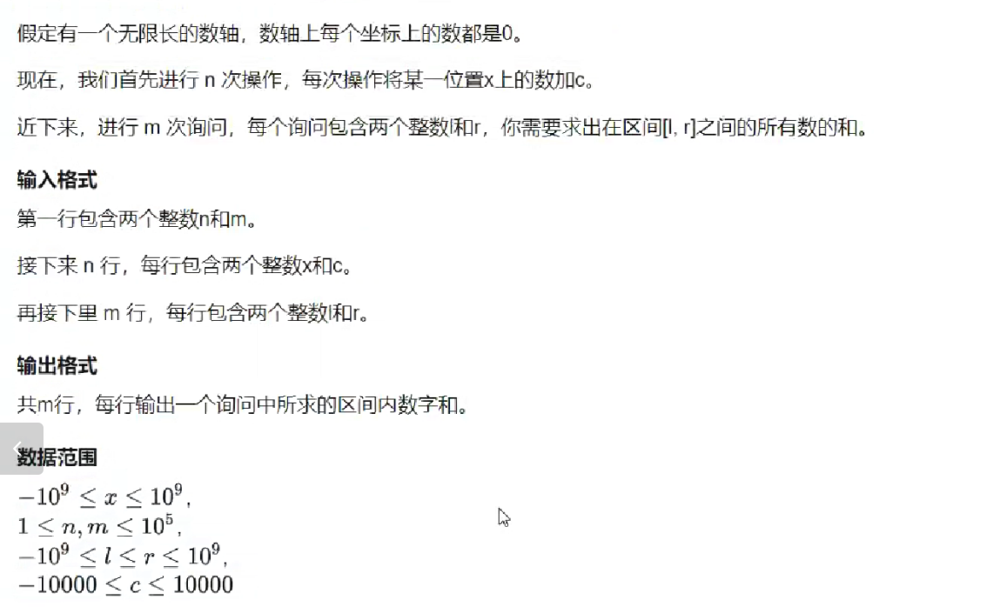

# 双指针

## 模板

```cpp
for (int i = 0, j = 0; i < n; i++)
{
    while (j < i && check(i, j))
        j++;
    // 具体问题逻辑
}
```


## 单词输出

```cpp
/*
输入 qwe asd zxc
输出
qwe
asd
zxc
*/

#include<iostream>
#include<string.h>

using namespace std;

int main(){
    char str[1000];

    gets(str);

    int n=strlen(str);

    for(int i=0;i<n;i++){
        int j = i;
        while (j < n&&str[j]!=' ') j++;

        //这道题目的具体逻辑
        for (int k = i; k < j;k++) cout << str[k];
        cout << endl;
        i = j;
    }
    return 0;
}
```

## 最长连续不重复子序列

```cpp
#include <iostream>
using namespace std;

const int N = 100010;

int n;
int a[N], s[N];

int main()
{
    cin >> n;
    for (int i = 0; i < n; i++)
    {
        cin >> a[i];
    }
    int res = 0;
    for (int i = 0, j = 0; i < n; i++)
    {
        s[a[i]]++;
        while (s[a[i]] > 1)
        {
            s[a[j]]--;
            j++;
        }
        res = max(res, i - j + 1);
    }
    cout << res << endl;
    return 0;
}
```

# 位运算


## 输出二进制

```cpp
#include<iostream>

using namespace std;

int main(){
    int n=10;
    for (int k = 3; k >= 0;k--)
        cout << (n >> k & 1) ;
    return 0;
}
```

**&:与运算,全为1时,才为1.**

## lowbit操作(统计1的个数)

**x=10001100100=>lowbit(x)=100;(二进制)**

**编码中:x>0,-x(补码)=(~x(反码)+1),即x取反加1(二进制)**

```cpp
#include<iostream>

using namespace std;

int lowbit(int x){
    return x & -x;
}

int main(){
    int n;
    cin >> n;
    while(n--){
        int x;
        cin >> x;

        int res=0;
        while(x){
            x-=lowbit(x);
            res++;
        }
        cout << res << ' ';
    }
    return 0;
}
```


# 离散化

```cpp
vector<int> alls;                                         // 存储所有戴离散化的值
sort(alls.begin(), alls.end());                           // 将所有值排序
alls.erase(unique(alls.begin(), alls.end()), alls.end()); // 去掉重复元素
```




```cpp
/*
输入
3 3
1 2
3 6
7 5
1 3
4 6
7 8
输出
8
0
5


*/

#include<bits/stdc++.h>

using namespace std;

typedef pair<int, int> PII;

const int N=30010;

int n,m;
int a[N],s[N];

vector<int> alls;
vector<PII> add,query;

int find(int x){
    int l=0,r=alls.size()-1;
    while(l<r){
        int mid=(l+r)>>1;
        if(alls[mid] >= x) r=mid;
        else l=mid+1;
    }
    return r + 1;
}

int main(){
    cin >> n >> m;
    for(int i=1;i<=n;i++){
        int x,c;
        cin >> x >> c;
        add.push_back({x,c});

        alls.push_back(x);
    }
    for(int i=1;i<=m;i++){
        int l,r;
        cin >> l >> r;
        query.push_back({l,r});

        alls.push_back(l);
        alls.push_back(r);
    }
    sort(alls.begin(),alls.end());
    alls.erase(unique(alls.begin(), alls.end()), alls.end());

    for (auto item :add){
        int x=find(item.first);
        a[x] += item.second;
    }
    for(int i=1;i<=(int)alls.size();i++)
        s[i] = s[i-1] + a[i];
    for(auto item : query){
        int l=find(item.first),r=find(item.second);
        cout << s[r] - s[l - 1] << endl;
    }
    return 0;
}
```


**坐标上的点,对应数组中的唯一编号**


# 合并区间

```cpp
/*
输入
5
1 2
2 4
5 6
7 8
7 9
输出
3


*/

#include<bits/stdc++.h>

using namespace std;

typedef pair <int,int > PII;
const int N=100010;
int n;
vector<PII>  segs;

void merge(vector<PII> &segs){
     vector<PII> res;
     sort(segs.begin(),segs.end());
     int st = -2e9, ed = -2e9;
     for(auto seg:segs){
          if(ed<seg.first){
               if(st!=-2e9)  res.push_back({st,ed});
               st = seg.first, ed = seg.second;
          }
          else ed = max(ed, seg.second); 
     }
     if(st!=-2e9) res.push_back({st,ed});

     segs = res;
}

int main(){
     ios::sync_with_stdio(false),cin.tie(0);
     cin >> n;
     for (int i = 0;i<n;i++){
          int l,r;
          cin >> l >> r;
          segs.push_back({l, r});
     }
     merge(segs);
     cout << segs.size() << endl;
}
```


