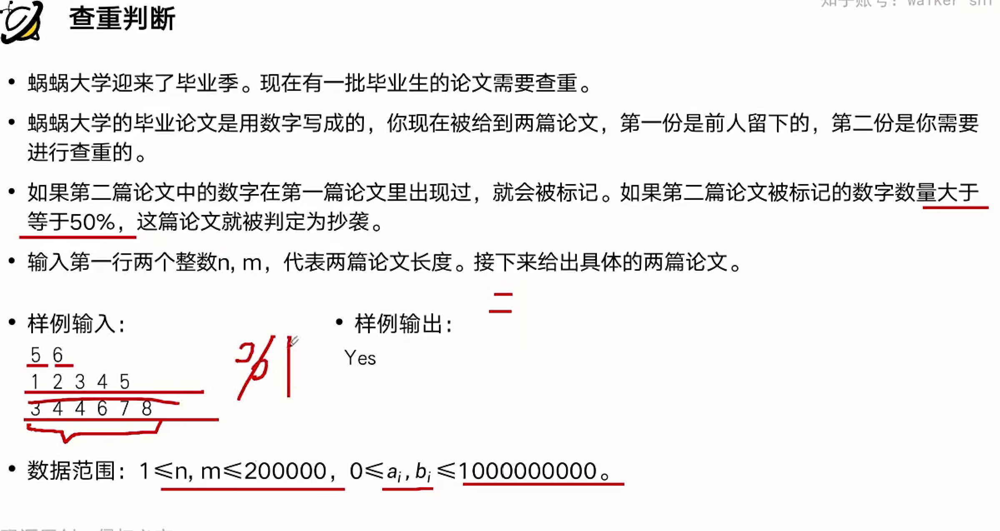
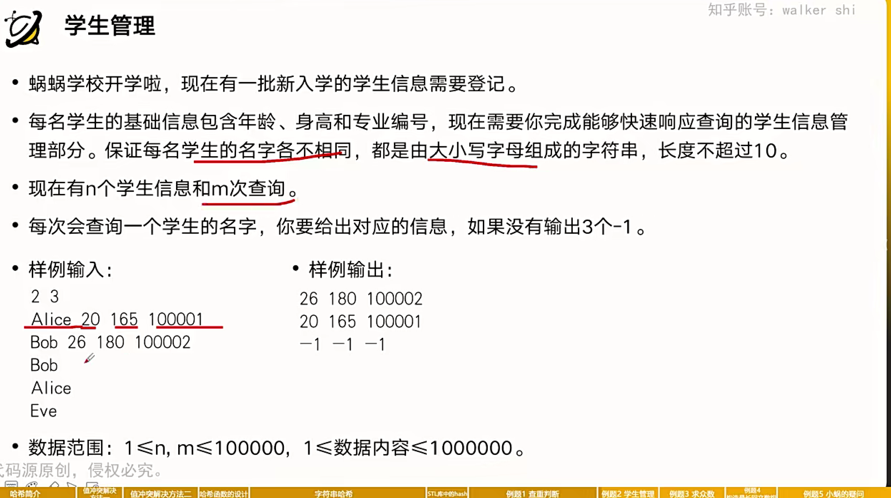
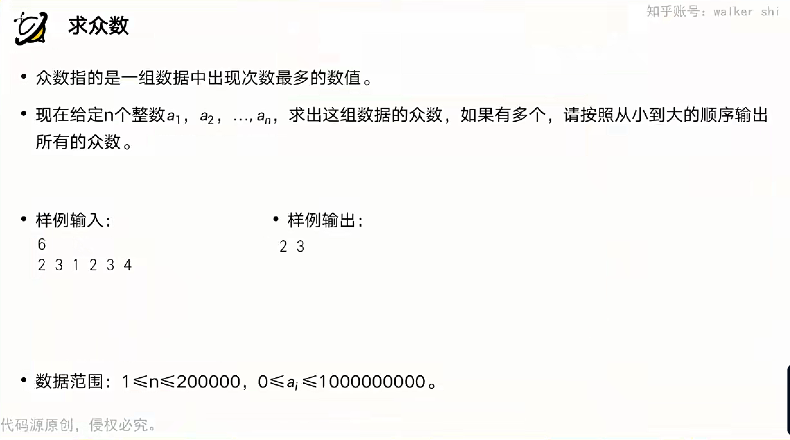
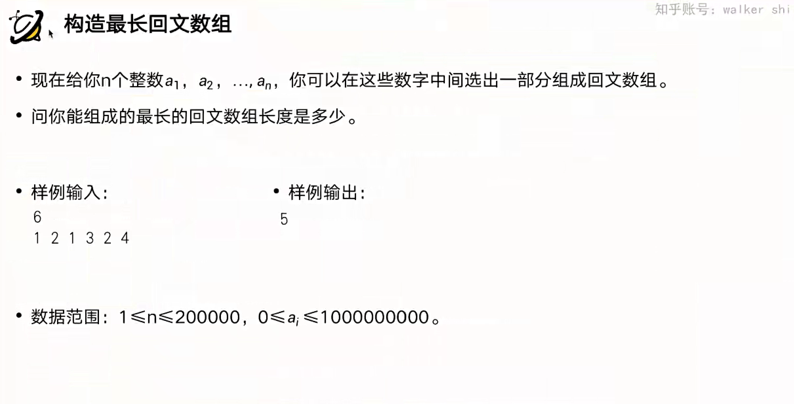
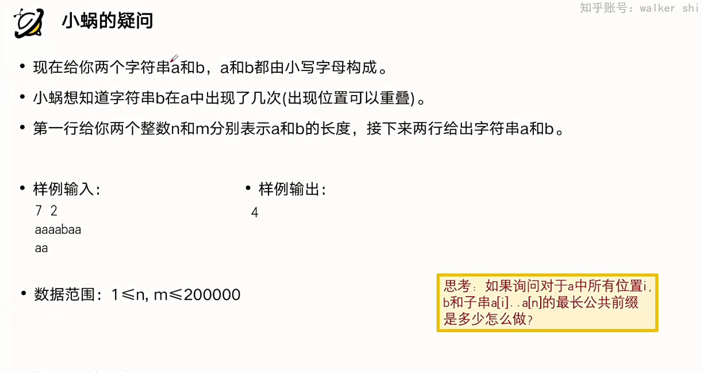

# 哈希表的用法

## 两种写法



### 链地址法

```cpp
#include<bits/stdc++.h>

using namespace std;

const int P=999971;
int n,m,a[200001],b[200001];
vector<int> c[P];

int main(){
    scanf("%d%d",&n,&m);
    for (int i = 1; i <= n;i++){
        scanf("%d", &a[i]);
    }
    for (int i = 1;i<=m;i++){
        scanf("%d", &b[i]);
    }
    for (int i = 1;i<P;i++){
        c[i].clear();
    }
    for (int i = 1; i <= n;i++){
        c[a[i] % P].push_back(a[i]);
    }
    int x=0;
    for (int i = 1; i <= m;i++){
        int v=b[i]%P;
        int l=c[v].size();
        bool ok=false;
        for (int j = 0; j < l&&!ok;j++){
            if(c[v][j]==b[i]){
                ok = true;
                x++;
            }
        }
    }
    if(2*x>=m){
        printf("Yes\n");
    }else{
        printf("No");
    }
}

```

### unorder_map

```cpp
#include <bits/stdc++.h>

using namespace std;
/*
5 6
1 2 3 4 5
3 4 5 6 7 8
*/
int n, m, a[200001], b[200001];
unordered_map<int, int> c;

int main()
{
    scanf("%d%d", &n, &m);
    for (int i = 1; i <= n; i++)
    {
        scanf("%d", &a[i]);
    }
    for (int i = 1; i <= m; i++)
    {
        scanf("%d", &b[i]);
    }
    c.clear();
    for (int i = 1; i <= n;i++){
        c[a[i]] = 1;
    }
        int x = 0;
    for (int i = 1; i <= m; i++)
    {
        if (c.find(b[i]) != c.end())
        {
            x++;
        }
    }
    if (2 * x >= m)
    {
        printf("Yes\n");
    }
    else
    {
        printf("No");
    }
}

```

## 学生管理



```cpp
#include<bits/stdc++.h>

using namespace std;
int n, m;
struct Info{
    int x, y, z;
};
unordered_map<string, Info> c;
int main(){
   scanf("%d%d",&n,&m);
   c.clear();
   for (int i = 1; i <= n;i++){
       string str;
      // cin >> str;太慢
       char s[21];
       scanf("%s",s);
       str = s;
       Info tmp;
       scanf("%d%d%d",&tmp.x,&tmp.y,&tmp.z);
       c[str] = tmp;
   }
   for(int i=1;i<=m;i++){
    string str;
    // cin >> str;太慢
    char s[21];
    scanf("%s", s);
    str = s;
    if (c.find(str) == c.end())
    {
        printf("-1 -1 -1\n");
    }
    else
    {
        printf("%d %d %d\n", c[str].x, c[str].y, c[str].z);
    }
   }
}
```

## 求众数



```cpp
#include<bits/stdc++.h>

using namespace std;
int n , a[20001];
unordered_map<int, int> c;
int main(){
   scanf("%d",&n);
   for (int i = 1; i <= n;i++){
    int x;
    scanf("%d",&x);
    ++c[x];
   }
   int x=0,l=0;
   for(auto itr:c){
    if(itr.second>x){
        x=itr.second,l=0;
    }
    if(itr.second==x){
        a[++l] = itr.first;
    }
   }
   sort(a+1,a+1+l);
   for (int i = 1; i <= l;i++){
       printf("%d ", a[i]);
   }
   printf("\n");
}
```

## 构造最长回文数



```cpp
#include<bits/stdc++.h>

using namespace std;
int n ;
unordered_map<int, int> c;
int main(){
   scanf("%d",&n);
   for (int i = 1; i <= n;i++){
    int x;
    scanf("%d",&x);
    ++c[x];
   }
   int x=0;
   bool odd = false;
   for(auto itr:c){
       if(itr.second & 1)
           {
               odd = true;
           }
           x += itr.second/2*2;
       
   }
   if(odd)  x++;

   printf("%d", x);
}
```

## 字符串哈希



### 单哈希

```cpp
#include <bits/stdc++.h>

using namespace std;

const int p = 999971, base = 101;
int n, m, ha[200011], hb[200011], c[200011];
char a[200011], b[200011];

int main()
{
    scanf("%d%d", &n, &m);
    scanf("%s%s", a + 1, b + 1);
    c[0] = 1;
    for (int i = 1; i <= 200000; i++)
    {
        c[i] = c[i - 1] * base % p;
    }
    for (int i = 1; i <= n; i++)
    {
        ha[i] = (ha[i - 1] * base + a[i] - 'a') % p;
    }
    for (int i = 1; i <= m; i++)
    {
        hb[i] = (hb[i - 1] * base + b[i] - 'a') % p;
    }
    int ans = 0;
    for (int i = 1; i + m - 1 <= n; i++)
    {
        if ((ha[i + m - 1] - 1ll * ha[i - 1] * c[m] % p + p) % p == hb[m])
            ++ans;
    }
    printf("%d", ans);
}
```

### 双哈希

```cpp
#include <bits/stdc++.h>

using namespace std;

const int p = 999971, base = 101;
const int p2 = 999979, base2 = 137;
int n, m, ha[200011], hb[200011], c[200011],c2[200011],ha2[200011],hb2[200011];
char a[200011], b[200011];

int main()
{
    scanf("%d%d", &n, &m);
    scanf("%s%s", a + 1, b + 1);
    c[0] = 1,c2[0]=1;
    for (int i = 1; i <= 200000; i++)
    {
        c[i] = c[i - 1] * base % p;
        c2[i] = c2[i - 1] * base2 % p2;
    }
    for (int i = 1; i <= n; i++)
    {
        ha[i] = (ha[i - 1] * base + a[i] - 'a') % p;
        ha2[i] = (ha2[i - 1] * base2 + a[i] - 'a') % p2;
    }
    for (int i = 1; i <= m; i++)
    {
        hb[i] = (hb[i - 1] * base + b[i] - 'a') % p;
        hb2[i] = (hb2[i - 1] * base2 + b[i] - 'a') % p2;
    }
    int ans = 0;
    for (int i = 1; i + m - 1 <= n; i++)
    {
        if ((ha[i + m - 1] - 1ll * ha[i - 1] * c[m] % p + p) % p == hb[m] &&
         (ha2[i + m - 1] - 1ll * ha2[i - 1] * c2[m] % p2 + p2) % p2 == hb2[m])
            ++ans;
    }
    printf("%d", ans);
}
```

