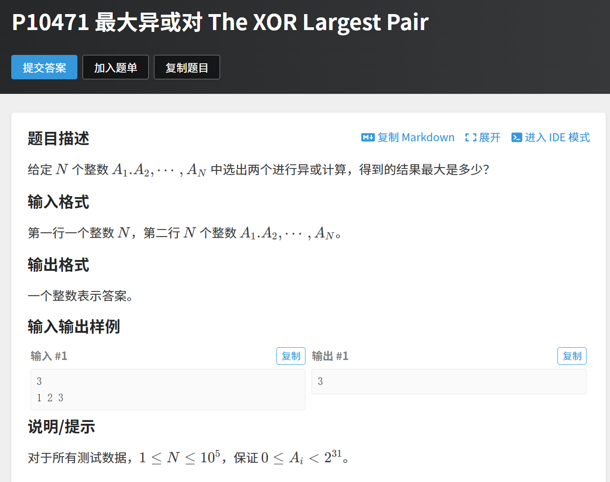
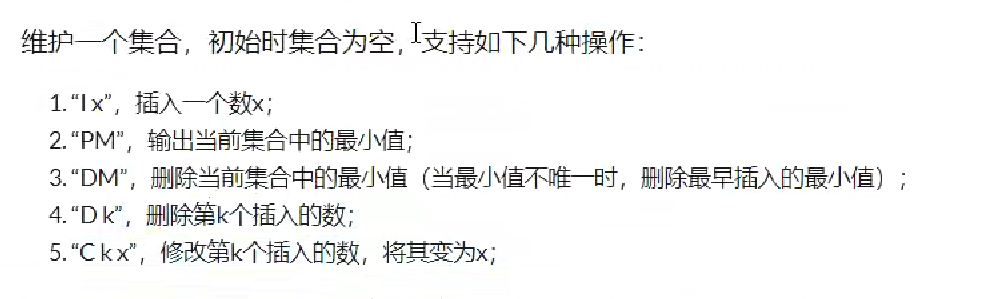

# 字典树


## 字母字典树

```cpp
#include <bits/stdc++.h>

using namespace std;

const int N = 100010;

int son[N][26], cnt[N], idx; // 下标是0的点,既是空节点,有时根结点
char str[N];
void insert(char str[])
{
    int p = 0;
    for (int i = 0; str[i]; i++)
    {
        int u = str[i] - 'a';
        if (!son[p][u])
            son[p][u] = ++idx;
        p = son[p][u];
    }
    cnt[p]++;
}
int query(char str[])
{
    int p = 0;
    for (int i = 0; str[i]; i++)
    {
        int u = str[i] - 'a';
        if (!son[p][u])
            return 0;
        p = son[p][u];
    }
    return cnt[p];
}

int main()
{
    int n;
    scanf("%d", &n);
    while (n--)
    {
        char op[2];
        scanf("%s%s", op, str);
        if (op[0] == 'I')
            insert(str);
        else
            printf("%d\n", query(str));
    }
}
/*
5
I abc
Q abc
Q ab
I ab
Q ab

输出
1 0 1

*/
```


## 数字字典树+位运算



```cpp
#include <bits/stdc++.h>
using namespace std;
typedef long long ll;

const int N = 1e7 + 5;
ll n, sum, ans;
ll a[N];
ll son[N][2]; // 二维数组存储字典树节点
ll idx;          // 节点计数器

void insert(ll num)
{
    ll now = 0;
    for (int i = 31; i >= 0; i--)
    {
        int t = (num >> i) & 1;
        if (!son[now][t])
            son[now][t] = ++idx; // 创建新节点
        now = son[now][t];       // 移动到子节点
    }
}

ll find(ll num)
{
    ll now = 0;
    ll ans = 0;
    for (int i = 31; i >= 0; i--)
    {
        int t = (num >> i) & 1;
        if (son[now][t ^ 1])
        { // 优先选择相反位
            now = son[now][t ^ 1];
            ans |= (1LL << i); // 设置该位为1
        }
        else
        {
            now = son[now][t]; // 只能选择相同位
        }
    }
    return ans;
}

int main()
{
    scanf("%lld", &n);
    for (int i = 1; i <= n; i++)
    {
        scanf("%lld", &a[i]);
        insert(a[i]);
    }
    for (int i = 1; i <= n; i++)
    {
        sum = max(sum, find(a[i])); // 更新最大异或值
    }
    printf("%lld\n", sum);
    return 0;
}
```


# 堆

## 最常用

```cpp
#include <bits/stdc++.h>

using namespace std;

const int N = 100010;

int n, m;
int h[N], Size;

void down(int u)
{
    int t = u;
    if (u * 2 <= Size && h[u * 2] < h[t])
        t = u * 2;
    if (u * 2 + 1 <= Size && h[u * 2 + 1] < h[t])
        t = u * 2 + 1;
    if (u != t)
    {
        swap(h[u], h[t]);
        down(t);
    }
}

void up(int u)
{
    while (u / 2 && h[u / 2] > h[u])
    {
        swap(h[u / 2], h[u]);
        u /= 2;
    }
}

int main()
{
    scanf("%d%d", &n, &m);
    for (int i = 1; i <= n; i++)
        scanf("%d", &h[i]);
    Size = n;
    for (int i = n / 2; i; i--) //这一步的时间复杂度是O(n)
        down(i);
    while (m--)
    {
        printf("%d ", h[1]);
        h[1] = h[Size];
        Size--;
        down(1);
    }
    return 0;
}

```

## 不常用(带映射关系)





```cpp
#include <bits/stdc++.h>

using namespace std;

const int N = 100010;

int n, m;
int h[N], ph[N], hp[N], Size;

void heap_swap(int a, int b)
{
    swap(ph[hp[a]], ph[hp[b]]);
    swap(hp[a], hp[b]);
    swap(h[a], h[b]);
}

void down(int u)
{
    int t = u;
    if (u * 2 <= Size && h[u * 2] < h[t])
        t = u * 2;
    if (u * 2 + 1 <= Size && h[u * 2 + 1] < h[t])
        t = u * 2 + 1;
    if (u != t)
    {
        heap_swap(u, t);
        down(t);
    }
}

void up(int u)
{
    while (u / 2 && h[u / 2] > h[u])
    {
        heap_swap(u / 2, u);
        u /= 2;
    }
}

int main()
{
    int n;
    scanf("%d", &n);
    while (n--)
    {
        char op[10];
        int k, x;
        scanf("%s", op);
        if (!strcmp(op, "I"))
        {
            scanf("%d", &x);
            Size++;
            m++;
            ph[m] = Size, hp[Size] = m;
            h[Size] = x;
            up(Size);
        }
        else if (!strcmp(op, "PM"))
        {
            printf("%d\n", h[1]);
        }
        else if (!strcmp(op, "DM"))
        {
            heap_swap(1, Size);
            Size--;
            down(1);
        }
        else if (!strcmp(op, "D"))
        {
            scanf("%d", &k);
            k = ph[k];
            heap_swap(k, Size);
            Size--;
            down(k), up(k);
        }
        else
        {
            scanf("%d%d", &k, &x);
            k = ph[k];
            h[k] = x;
            down(k), up(k);
        }
    }
    return 0;
}

/*
输入
8
I -10
PM
I -10
D 1
C 2 8
I 6
PM
DM


*/

```


# 数状数组

```cpp
#include <bits/stdc++.h>

using namespace std;

vector<int> b;

int lowbit(int x)
{
    return x & (-x);
}

void add(int p, int x)
{ // 修改位置p的值（树状数组更新）
    while (p < b.size())
    {
        b[p] += x;
        p += lowbit(p);
    }
}

int sum(int p)
{ // 查询前p项的和（树状数组查询前缀和）
    int res = 0;
    while (p > 0)
    {
        res += b[p];
        p -= lowbit(p);
    }
    return res;
}
```

