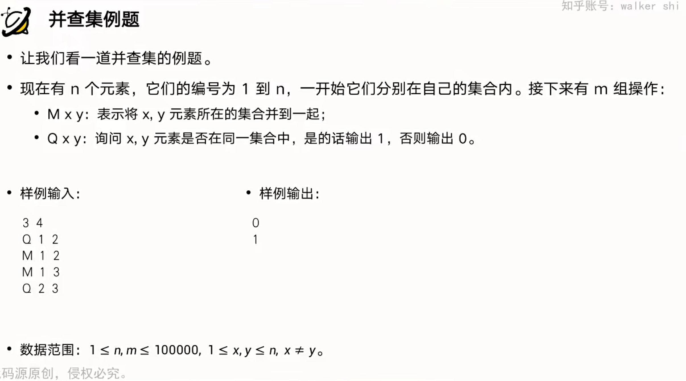
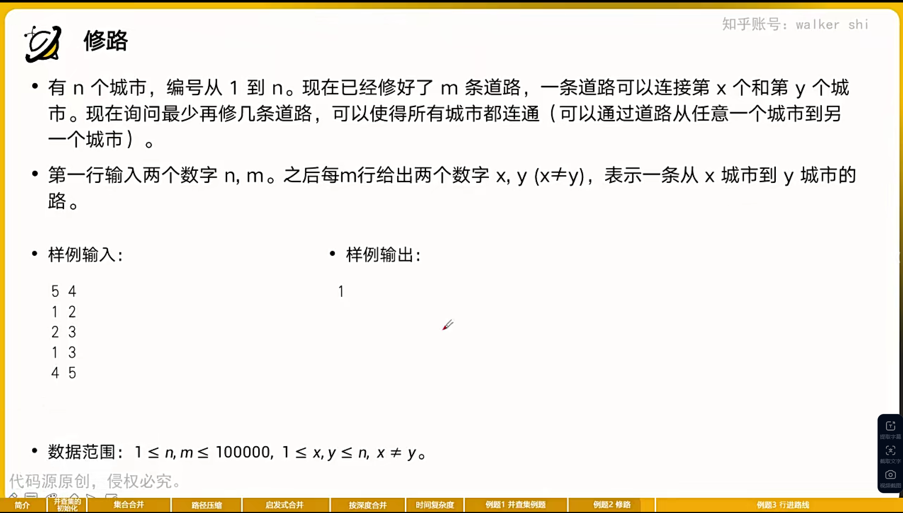
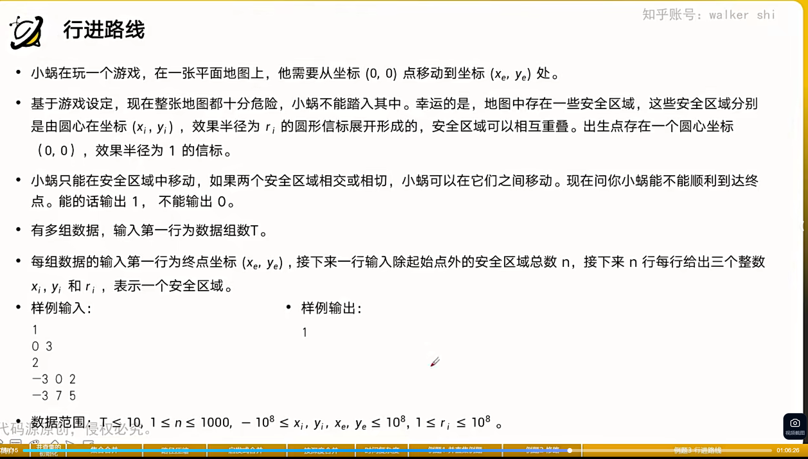

# 并查集例题

## 例题一



```cpp
#include<bits/stdc++.h>

using namespace std;
int n,m,f[100001],s[100001];//启发式合并
char str[11];
int findset(int x){
  if(x==f[x])
    {
      return x;
    }
    f[x]=findset(f[x]);
    return f[x];
}

int main(){
  scanf("%d%d",&n,&m);
  for(int i=1;i<=n;i++){
    f[i] = i,s[i]=1;
  }
  for(int i=1;i<=m;i++){
    int x, y;
    scanf("%s%d%d",str,&x,&y);
    if(str[0]=='M'){
      int fx=findset(x),fy=findset(y);
      if(fx==fy)
       {
         continue;
       }
       if(s[fx]>s[fy]){
         swap(fx, fy);
       }
      f[fx] = fy;
      s[fy] += s[fx];
    }else{
      int fx=findset(x),fy=findset(y);
      if(fx==fy)
        printf("1\n");
        else
          printf("0\n");
    }
  }
  return 0;
}
```

## 修路



```cpp
#include <bits/stdc++.h>

using namespace std;
int n,m,f[100001];

int findset(int x){
  if(x==f[x]){
    return x;
  }
  f[x]=findset(f[x]);
  return f[x];
}

int main(){
  scanf("%d%d",&n,&m);
  for(int i=1;i<=n;i++){
    f[i] = i;
  }
  for(int i=1;i<=m;i++){
    int x,y;
    scanf("%d%d",&x,&y);
    int fx = findset(x), fy = findset(y);
    if(fx==fy){
      continue;
    }
    f[fx] = fy;
  }
  int cnt = 0;
 for(int i=1;i<=n;i++){
  if(i==f[i]){
    cnt++;
  }
 }
  printf("%d", cnt-1);
}
```

## 行进路线



```cpp
#include<bits/stdc++.h>

using namespace std;

int test,n,f[1001],a[1001][3];

int findset(int x){
  if(x==f[x]){
    return x;
  }
  f[x]=findset(f[x]);
  return f[x];
}

int main(){
  scanf("%d",&test);
  while(test--){
    int xe,ye;
    scanf("%d%d", &xe, &ye);
    int n;
    scanf("%d",&n);
    for(int i=1;i<=n;i++){
      scanf("%d%d%d",&a[i][0],&a[i][1],&a[i][2]);
    }
    a[0][0]=0,a[0][1]=0,a[0][2]=1;
    for (int i = 0;i<=n;i++){
      f[i] = i;
    }
    for(int i=0;i<=n;i++){
      for (int j = i + 1; j <= n;j++){
        if (1ll * ((a[i][0] - a[j][0]) * (a[i][0] - a[j][0])) + 1ll * ((a[i][1] - a[j][1]) * (a[i][1] - a[j][1])) <= 1ll * ((a[i][2] + a[j][2]) * (a[i][2] + a[j][2]))){
          int fi=findset(i),fj=findset(j);
          if(fi==fj){
            continue;
          }
          f[fi] = fj;
        }
      }
    }
   
    int idx=-1;
    for(int i=0;i<=n;i++){
      if (1ll * ((a[i][0] - xe) * (a[i][0] - xe)) + 1ll * ((a[i][1] - ye) * (a[i][1] -ye)) <= 1ll * (a[i][2] * a[i][2] )){
        idx = i;
      }
    }
     
    if(idx!=-1&&findset(idx)==findset(0)){
      printf("1\n");
    }else{
      printf("0\n");
    }
  }
}
/*
1
0 3
2
-3 0 2
-3 7 5
*/
```

