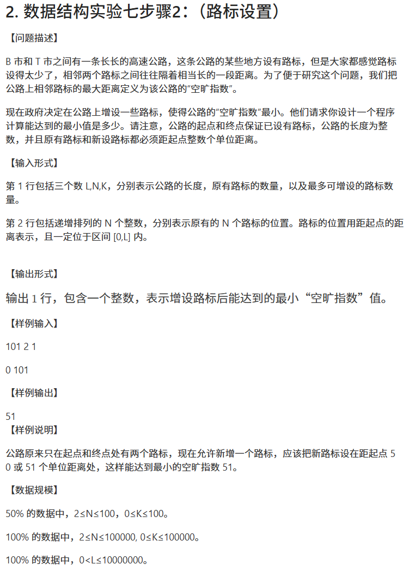

# 排序


## 快速排序

> 分治思想

快排思想

```cpp
int huafen(int q[],int l,int r){
     int mid=q[l];
     while(l<r){
          while(q[r]>=mid&&l<r) r--;
          q[l]=q[r];
          while (q[l]<=mid&&l<r)  l++;
          q[r] = q[l];
     }
     q[l]=mid;
     return l;
}

void quick_sort(int q[],int l,int r){
     if(l>=r)  return ;
     int M=huafen(q,l,r);
     quick_sort(q,l,M-1);
     quick_sort(q, M + 1, r);
}
```

时间复杂度:n*logn

空间复杂度:logn(递归调用栈)

以下是简洁代码的实现

```cpp
#include <iostream>

using namespace std;
const int N = 1e6 + 10;
int n;
int q[N];

void quick_sort(int q[], int l, int r)
{
    if (l >= r)
        return;

    int x = q[l], i = l - 1, j = r + 1;
    while (i < j)
    {
        do i++; while (q[i] < x);
        do j--; while (q[j] > x);
        if (i < j) swap(q[i], q[j]);
    }
    quick_sort(q, l, j);
    quick_sort(q, j + 1, r);
}

int main()
{
    scanf("%d", &n);
    for (int i = 0; i < n; i++) scanf("%d", &q[i]);
    
    quick_sort(q, 0, n - 1);

    for (int i = 0; i < n; i++) printf("%d ", q[i]);
    return 0;
}
```

## 归并排序

> 分治思想

```cpp
#include<iostream>

using namespace std;

const int N=1000010;

int n;
int q[N],tmp[N];


void merge_sort(int q[],int l,int r){
    if(l>=r)  return ;
    int mid = (l + r) >> 1;
    merge_sort(q,l,mid),merge_sort(q,mid+1,r);

    int k = 0,i=l,j=mid+1;
    while(i <= mid&&j <= r){
        if(q[i] <= q[j])  tmp[k++] = q[i++];
        else tmp[k++] = q[j++];
    }
        while(i <= mid)  tmp[k++] = q[i++];
        while(j <= r)    tmp[k++] =q[j++];

        for ( i = l,j=0; i <= r;i++,j++) q[i] = tmp[j];
    
}


int main(){
    scanf("%d",&n);
    for (int i = 0; i < n;i++) scanf("%d", &q[i]);
    merge_sort(q,0,n-1);
    for(int i=0;i<n;i++)  printf("%d ",q[i]);
    return 0;
}
```

```txt
我将使用一个包含 6 个元素的数组 [38, 27, 43, 3, 9, 82] 来详细解释归并排序的递归过程和执行顺序。
归并排序的递归执行流程
初始调用：merge_sort(q, 0, 5)
数组：[38, 27, 43, 3, 9, 82]
mid = (0+5)/2 = 2
步骤：
递归排序左半部分 merge_sort(q, 0, 2) → [38, 27, 43]
递归排序右半部分 merge_sort(q, 3, 5) → [3, 9, 82]
合并已排序的两部分
左半部分排序 merge_sort(q, 0, 2)
数组：[38, 27, 43]
mid = (0+2)/2 = 1
步骤：
递归排序左半部分 merge_sort(q, 0, 1) → [38, 27]
递归排序右半部分 merge_sort(q, 2, 2) → [43]（单元素直接返回）
合并 [27, 38] 和 [43] → [27, 38, 43]
右半部分排序 merge_sort(q, 3, 5)
数组：[3, 9, 82]
mid = (3+5)/2 = 4
步骤：
递归排序左半部分 merge_sort(q, 3, 4) → [3, 9]
递归排序右半部分 merge_sort(q, 5, 5) → [82]（单元素直接返回）
合并 [3, 9] 和 [82] → [3, 9, 82]
最终合并左右两部分
左半部分：[27, 38, 43]
右半部分：[3, 9, 82]
合并结果：[3, 9, 27, 38, 43, 82]
```

### 求逆序对(应用)

```cpp
#include<bits/stdc++.h>

using namespace std;
long long ans;
int n,a[500001],tmp[500001];

void merge_sort(int q[],int l,int r){
    if(l>=r) return ;
    int mid=(l+r)>>1;
    merge_sort(q,l,mid),merge_sort(q,mid+1,r);
    int k=0,i=l,j=mid+1;
    while(i<=mid&&j<=r){
        if(q[i]<=q[j]){
            tmp[k++] = q[i++];
        }else{
            tmp[k++]=q[j++];
            ans += mid - i + 1;
        }
    }
    while(i<=mid){
        tmp[k++] = q[i++];
    }
    while(j<=r){
        tmp[k++] = q[j++];
    }
    for (int i = l, j = 0;i<=r;i++,j++){
        q[i] = tmp[j];
    }
}


int main(){
    scanf("%d",&n);
    for (int i = 1; i <= n;i++){
        scanf("%d", &a[i]);
    }
    merge_sort(a,1,n);
    cout << ans;
}

```


# 二分

## 整数二分

```cpp
//自创写法
#include <bits/stdc++.h>

using namespace std;
int a[11];
// 靠右二分 
int Rbinary_search1(int a[], int x, int low, int high)
{
    int l = low, r = high;
    while (l <= r)
    {
        int mid = (l + r) / 2;
        if (a[mid] <= x)
            l = mid + 1;
        else
            r = mid - 1;
    }
    return r;
}
// 靠左二分
int Lbinary_search2(int a[], int x, int low, int high)
{
    int l = low, r = high;
    while (l <= r)
    {
        int mid = (l + r) / 2;
        if (a[mid] >= x)
            r = mid - 1;
        else
            l = mid + 1;
    }
    return l;
}

int main()
{
    for (int i = 1; i <= 5; i++)
        a[i] = 5;
    for (int i = 6; i <= 10; i++)
        a[i] = 7;
    cout << "idx: ";
    for (int i = 1; i <= 10; i++)
        cout << i << ' ';
    cout << endl;
    cout << "key: ";
    for(int i=1;i<=10;i++)
    cout << a[i] << ' ';

    cout << endl;
    cout << "寻找最右边的5的下标"<<endl;
    int pos1=Rbinary_search1(a,5,1,10);
    cout << "5-R-idx:" << pos1 << endl;

    cout << "寻找最左边的5的下标" << endl;
    int pos2 = Lbinary_search2(a, 5, 1, 10);
    cout << "5-L-idx:" << pos2 << endl;

    cout <<"探讨未找到的情况"  << endl<< "寻找最右边的6的下标" << endl;
    int pos3 = Rbinary_search1(a, 6, 1, 10);
    cout << "6-R-idx: " << pos3 << endl;

    cout << "寻找最左边的6的下标" << endl;
    int pos4 = Lbinary_search2(a, 6, 1, 10);
    cout << "6-L-idx: " << pos4 << endl;
}
```


==总结:对于能够查找到时:靠右二分函数返回的是r,靠左二分返回的是l;==


==对于查找不到x时,如果返回l则A[l]大于x的,如果返回r则A[r]小于x,因为最后while中断的条件是l=r+1==


```cpp
//acwing写法
//靠左二分

#include <bits/stdc++.h>

using namespace std;
int n, m;
int a[1000001];

void binary_search(int q[], int l, int r, int x)
{
    while (l < r)
    {
        int mid = (l + r) >> 1;
        if (q[mid] >= x)
            r = mid;
        else
            l = mid + 1;
    }
    if (q[l] == x)
    {
        printf("%d ", l);
    }
    else
    {
        printf("-1 ");
    }
}
int main()
{
    scanf("%d%d", &n, &m);
    for (int i = 1; i <= n; i++)
    {
        scanf("%d", &a[i]);
    }
    while (m--)
    {
        int x;
        scanf("%d", &x);
        binary_search(a, 1, n, x);
    }
}

```

```cpp
//靠右二分

#include <bits/stdc++.h>

using namespace std;
int n, m;
int a[1000001];

void binary_search(int q[], int l, int r, int x)
{
    while (l < r)
    {
        int mid = (l + r + 1) >> 1;
        if (q[mid] <= x)
            l = mid;
        else
            r = mid - 1;
    }
    if (q[l] == x)
    {
        printf("%d ", l);
    }
    else
    {
        printf("-1 ");
    }
}
int main()
{
    scanf("%d%d", &n, &m);
    for (int i = 1; i <= n; i++)
    {
        scanf("%d", &a[i]);
    }
    while (m--)
    {
        int x;
        scanf("%d", &x);
        binary_search(a, 1, n, x);
    }
}
```


### 练习题一



```cpp
#include <bits/stdc++.h>
using namespace std;
int L, N, K;
int pos[100005]; // 存储原有路标的位置
int main()
{
     scanf("%d%d%d", &L, &N, &K);
     for (int i = 0; i < N; i++)
     {
          scanf("%d", &pos[i]);
     }

     // 计算相邻路标之间的距离
     vector<int> distances;
     for (int i = 1; i < N; i++)
     {
          distances.push_back(pos[i] - pos[i - 1]);
     }

     // 二分查找最小的最大空旷指数
     int left = 1, right = L; // 初始搜索范围
     int result = L;

     while (left <= right)
     {
          int mid = (left+right)/2;
          int sum = 0;

          // 计算在当前空旷指数下需要的路标数
          for (int d : distances)
          {
               if (d > mid)
               {
                    sum += (d - 1) / mid; // 需要的路标数
               }
          }

          if (sum <= K)
          {
               // 当前空旷指数可行，尝试更小的
               result = mid;
               right = mid - 1;
          }
          else
          {
               // 当前空旷指数太小，需要更大的
               left = mid + 1;
          }
     }

     printf("%d\n", result);
     return 0;
}
```


## 浮点数二分

**不用考虑边界**

```cpp
//求一个数的开方
#include<iostream>

using namespace std;

int main(){
    double x;
    cin >> x;
    double l = 0, r = x;
    while(r-l>1e-8){
        double mid = (l + r) / 2;
        if(mid*mid>=x) r=mid;
        else l=mid;
    }
    printf("%lf", l);
    return 0;
}
```

