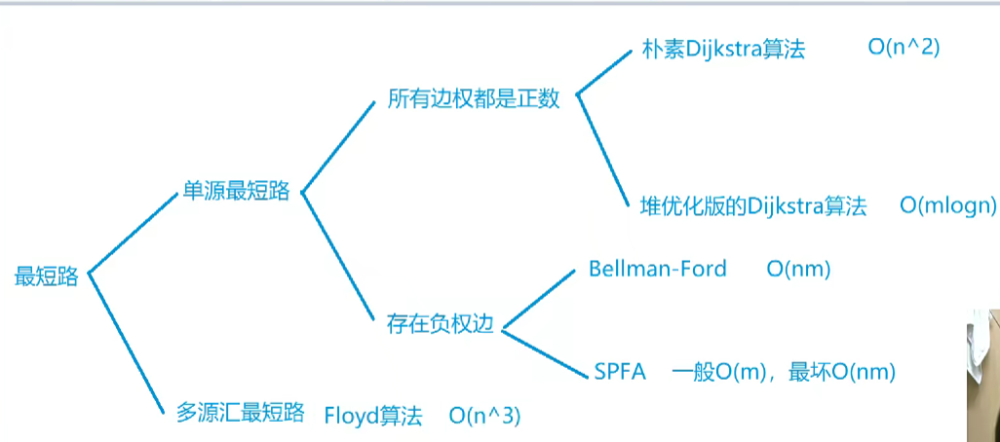

# 最短路



## 单源最短路

### 朴素dijkstra

**时间复杂度O(n^2),适用于稠密图,所以用邻接矩阵存储**

```cpp
#include<cstring>
#include<iostream>
#include<algorithm>

using namespace std;

const int N=510;

int n,m;
int g[N][N];
int dist[N];
bool st[N];

int dijkstra(){
    memset(dist,0x3f,sizeof(dist));
    dist[1] = 0;
    for(int i=0;i<n;i++){
        int t=-1;
        for(int j=1;j<=n;j++){
            if(!st[j] && (t==-1||dist[t]>dist[j]))
                t = j;
        }
        st[t]=true;

        for (int j = 1;j<=n;j++)
            dist[j] = min(dist[j], dist[t] + g[t][j]);
    }

    if(dist[n]==0x3f3f3f) return -1;
    return dist[n];
}

int main(){
    scanf("%d%d",&n,&m);
    memset(g,0x3f,sizeof(g));

    while(m--){
        int a,b,c;
        scanf("%d%d%d",&a,&b,&c);
        g[a][b] = min(g[a][b], c);
    }

    int t=dijkstra();

    printf("%d\n", t);
}
```

### 堆优化dijkstra

**时间复杂度m*logn**

```cpp
#include<bits/stdc++.h>
using namespace std;

const int N = 100010;
typedef pair<int, int> PII;

int n, m;
vector<PII> edge[N];
int dist[N];
bool st[N];

int dijkstra()
{
    memset(dist, 0x3f, sizeof(dist));
    dist[1] = 0;
    priority_queue<PII, vector<PII>, greater<PII>> heap;
    heap.push({0, 1});
    while (heap.size())
    {
        auto t = heap.top();
        heap.pop();

        int ver = t.second;
        if (st[ver])
            continue;
        st[ver] = true;

        for (auto k : edge[ver])
        {
            int to = k.first;
            int w = k.second;
            if (dist[to] > dist[ver] + w)
            {
                dist[to] = dist[ver] + w;
                heap.push({dist[to], to});
            }
        }
    }

    if (dist[n] == 0x3f3f3f3f)
        return -1;
    return dist[n];
}

int main()
{
    scanf("%d%d", &n, &m);

    while (m--)
    {
        int a, b, c;
        scanf("%d%d%d", &a, &b, &c);
        edge[a].push_back({b, c});
    }

    int t = dijkstra();

    printf("%d\n", t);
}
/*
3 3
1 2 2
2 3 1
1 3 4
输出
3

*/
```


### 朴素bellman_ford

**时间复杂度:O(nm)**

**k是经过多少条边,该算法可以求一点点经过多少条边到另外一点的最短路径**

求1到n的最短路径,k为n-1

```cpp
#include<bits/stdc++.h>

using namespace std;
const int N = 510, M = 10010;

int n,m,k;
int dist[N],backup[N];

struct Edge{
    int a, b, w;
}edges[M];

int bellman_ford(){
    memset(dist, 0x3f, sizeof(dist));
    dist[1] = 0;
    for(int i=0;i<k;i++){
        memcpy(backup,dist,sizeof(dist));
        for (int j = 0;j<m;j++){
            int a = edges[j].a, b = edges[j].b, w = edges[j].w;
            dist[b] = min(dist[b], backup[a] + w);
        }
    }
    if(dist[n]>0x3f3f3f3f/2)  return -1;  //防止∞+(-10) 更新∞
    return dist[n];
}

int main(){
    scanf("%d%d%d",&n,&m,&k);
    for (int i = 0; i < m;i++){
        int a,b,w;
        scanf("%d%d%d", &a, &b, &w);
        edges[i] = {a, b, w};
    }
    int t=bellman_ford();
    printf("%d", t);
}
/*
3 3 1
1 2 1
2 3 1
1 3 3
输出
3
*/
```


### 优化spfa

**限制:图中有负环**

**时间复杂度一般O(m),最坏O(nm)**

```cpp
#include<bits/stdc++.h>
using namespace std;

const int N = 100010;
typedef pair<int, int> PII;

int n, m;
vector<PII> edge[N];
int dist[N];
bool st[N];

int spfa()
{
    memset(dist, 0x3f, sizeof(dist));
    dist[1] = 0;
    queue<int> q;
    q.push(1);
    st[1]=true;

    while(q.size()){
        int t=q.front();
        q.pop();
        st[t]=false;

        for (auto k:edge[t]){
            int to=k.first,w=k.second;
            if(dist[to] > dist[t] + w){
                dist[to] = dist[t] + w;
                if(!st[to]){
                    q.push(to);
                    st[to] = true;
                }
            }
        }
    }

    if (dist[n] == 0x3f3f3f3f)
        return -1;
    return dist[n];
}

int main()
{
    scanf("%d%d", &n, &m);

    while (m--)
    {
        int a, b, c;
        scanf("%d%d%d", &a, &b, &c);
        edge[a].push_back({b, c});
    }

    int t = spfa();

    printf("%d\n", t);
}
/*
3 3
1 2 2
2 3 1
1 3 4
输出
3

*/
```

### spfa检测负环

```cpp
#include<bits/stdc++.h>
using namespace std;

const int N = 100010;
typedef pair<int, int> PII;

int n, m;
vector<PII> edge[N];
int dist[N],cnt[N];
bool st[N];

int spfa()
{
    queue<int> q;
    for (int i = 1;i<=n;i++){
        st[i]=true;
        q.push(i);
    }

        while (q.size())
        {
            int t = q.front();
            q.pop();
            st[t] = false;

            for (auto k : edge[t])
            {
                int to = k.first, w = k.second;
                if (dist[to] > dist[t] + w)
                {
                    dist[to] = dist[t] + w;
                    cnt[to] = cnt[t] + 1;

                    if(cnt[to] >= n)  return true;
                    if (!st[to])
                    {
                        q.push(to);
                        st[to] = true;
                    }
                }
            }
        }
        return false;
}

int main()
{
    scanf("%d%d", &n, &m);

    while (m--)
    {
        int a, b, c;
        scanf("%d%d%d", &a, &b, &c);
        edge[a].push_back({b, c});
    }

   if(spfa()) puts("yes");
   else puts("no");
}
/*
3 3
1 2 -1
2 3 4
3 1 -4
输出
yes

*/
```


## 多源最短路


### Floyd

```cpp
#include<bits/stdc++.h>

using namespace std;

const int N = 210, INF = 1e9;

int n,m,Q;
int d[N][N];

void floyd(){
    for (int k = 1; k <= n;k++){
        for(int i=1;i<=n;i++){
            for (int j = 1;j<=n;j++){
                d[i][j] = min(d[i][j], d[i][k] + d[k][j]);
            }
        }
    }
}

int main(){
    scanf("%d%d%d",&n,&m,&Q);

    for (int i = 1; i <= n;i++){
        for (int j = 1;j<=n;j++){
            if(i==j)  d[i][j]=0;
            else d[i][j]=INF;
        }
    }
    while(m--){
        int a,b,w;
        scanf("%d%d%d",&a,&b,&w);
        d[a][b] = min(d[a][b], w);//重边
    }
    floyd();
    while(Q--){
        int a,b;
        scanf("%d%d",&a,&b);
        if(d[a][b]>INF/2) puts("impossible");
        else printf("%d\n", d[a][b]);
    }
    return 0;
}
/*
3 3 2
1 2 1
2 3 2
1 3 1
2 1
1 3
输出
impossible
1


*/
```

