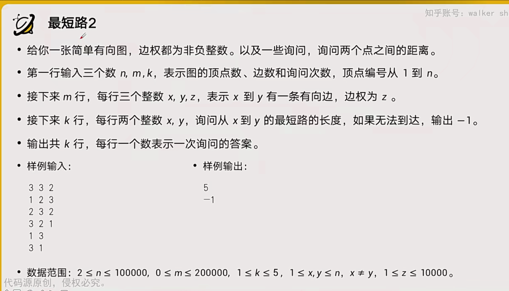
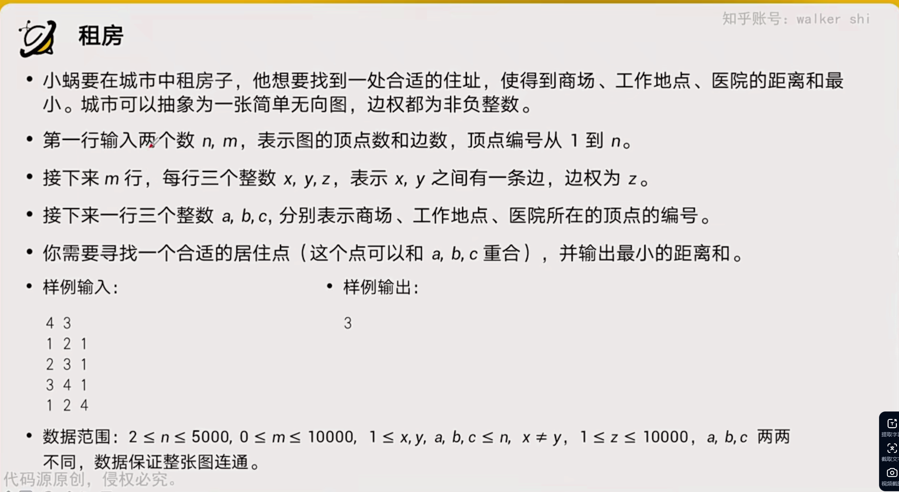
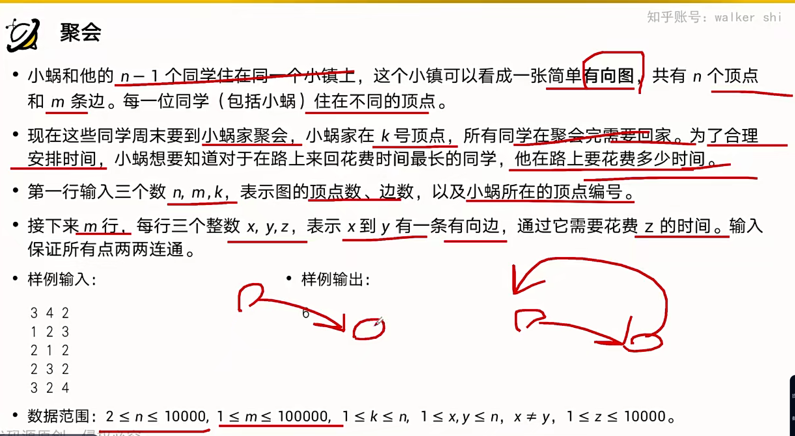
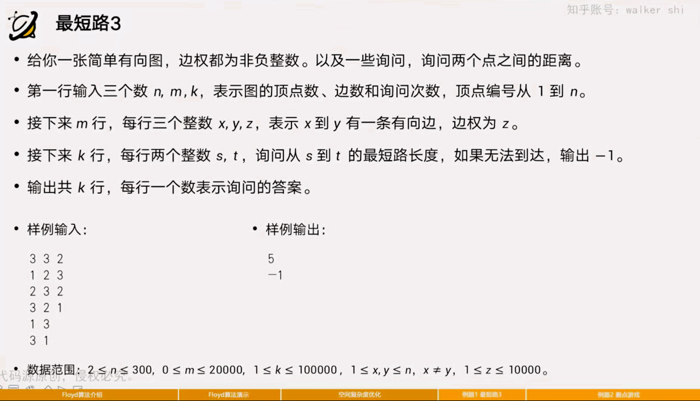
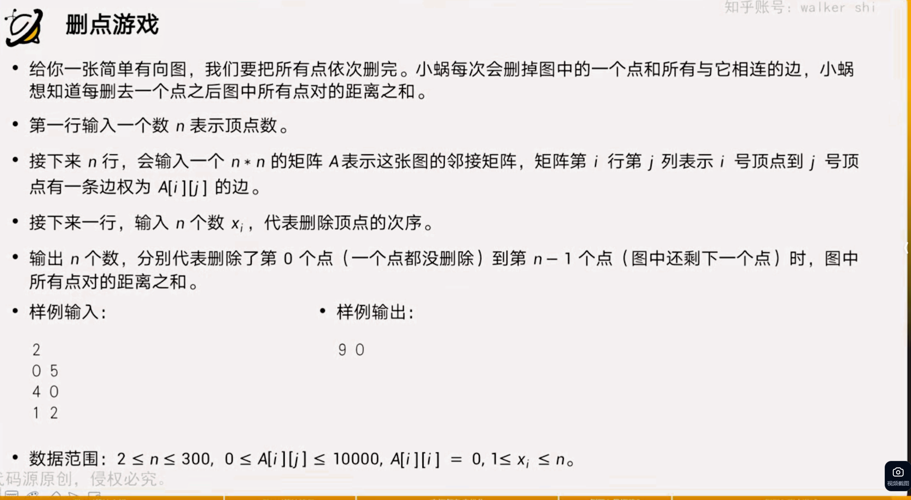
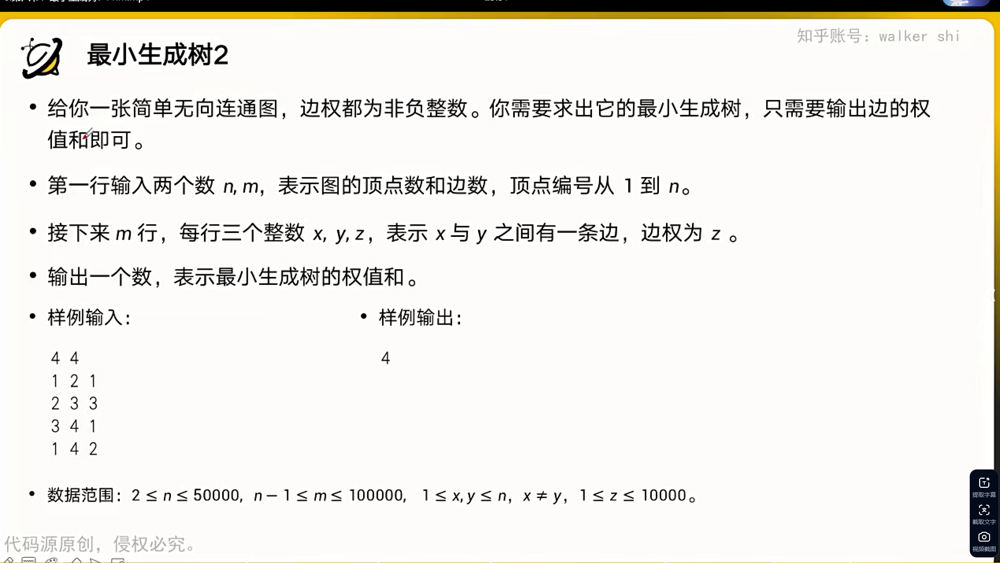
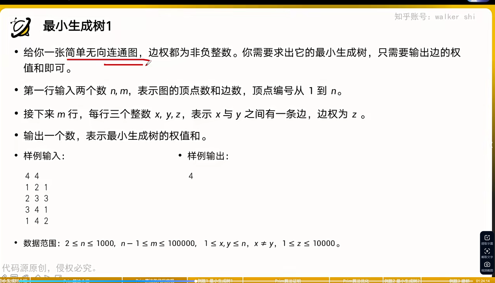
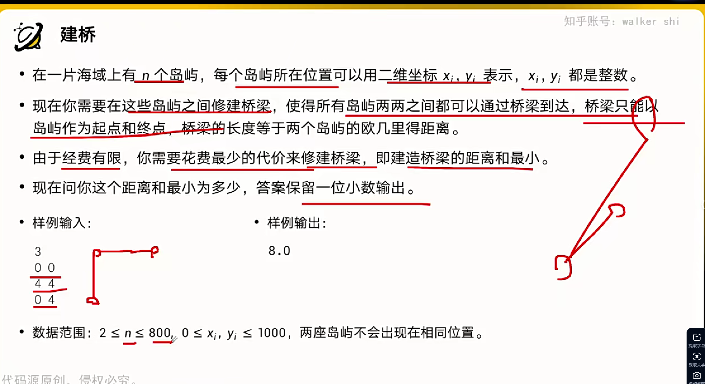
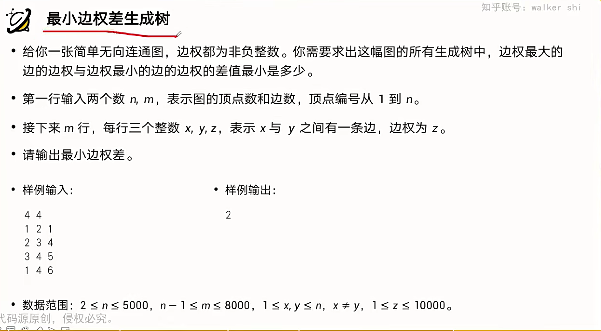

# Dijkstra


## 算法的两种写法



### 写法一(未优化)


```cpp
#include<bits/stdc++.h>
using namespace std;
struct Node{
    int y,v;
    Node(int _y, int _v) { y = _y;
        v = _v;
    }
};

vector < Node > edge[5001];
int n, m, k,dist[5001];
bool b[5001];


inline void dijkstra(int s,int t){
    memset(dist, 127, sizeof(dist));
    memset(b, false, sizeof(b));
    dist[s] = 0;
    for (;;){
        int x=-1;
        for (int i = 1; i <= n;i++){
            if(!b[i]&&dist[i] < 1<<30){
                if(x==-1 || dist[i]<dist[x]){
                    x = i;
                }
            }
        }
        if(x==-1||x==t){
            break;
        }
        b[x] = true;
        for(auto i: edge[x]){
            dist[i.y] = min(dist[i.y], dist[x] + i.v);
        }
    }
    if(dist[t]<1<<30){
        cout << dist[t] << endl;
    }else{
        cout << -1 << endl;
    }
}


int main(){
    cin >> n >> m >> k;
    for (int i = 1; i <= m;i++){
        int x,y,z;
        cin >> x >> y >> z;
        edge[x].push_back(Node(y, z));
    }
    for (int i = 1; i <= k;i++){
        int s,t;
        cin >> s >> t;
        dijkstra(s, t);
    }
}
```


**时间复杂度:O(n^2+m)**    n是顶点数,m是边数


### 写法二(set优化)

```cpp
#include<bits/stdc++.h>
using namespace std;
struct Node{
    int y,v;
    Node(int _y, int _v) { y = _y;
        v = _v;
    }
};
set<pair<int, int>> q;
vector < Node > edge[100001];
int n, m, k,dist[100001];


inline void dijkstra(int s,int t){
    memset(dist, 127, sizeof(dist));
    dist[s]=0;
    q.clear();
    for (int i = 1; i <= n;i++){
        q.insert({dist[i], i});
    }
    for (; !q.empty();){
        int x = q.begin()->second;
        if(x==t || dist[x] > 1<<30){
            break;
        }
        q.erase(q.begin());
        for(auto i:edge[x]){
            if(dist[x]+i.v<dist[i.y]){
                q.erase({dist[i.y], i.y});
                dist[i.y] = dist[x] + i.v;
                q.insert({dist[i.y], i.y});
            }
        }
    }
    if(dist[t] < 1<<30){
        cout << dist[t] << endl;
    }else{
        cout << -1 << endl;
    }
}


int main(){
    cin >> n >> m >> k;
    for (int i = 1; i <= m;i++){
        int x,y,z;
        cin >> x >> y >> z;
        edge[x].push_back(Node(y, z));
    }
    for (int i = 1; i <= k;i++){
        int s,t;
        cin >> s >> t;
        dijkstra(s, t);
    }
}

/*
输入
3 3 2
1 2 3
2 3 2
3 2 1
1 3
3 1

输出
5
-1


*/
```

**时间复杂度:O((n+m)*logn**


## 练习题一




```cpp
#include <bits/stdc++.h>
using namespace std;
struct Node
{
    int y, v;
    Node(int _y, int _v)
    {
        y = _y;
        v = _v;
    };
};
set<pair<int, int>> q;
vector<Node> edge[5001];
int a, b, c, n, m, dist[5001],f[3][5001];

inline void dijkstra(int s)
{
    memset(dist, 127, sizeof(dist));
    dist[s] = 0;
    q.clear();
    for (int i = 1; i <= n; i++)
    {
        q.insert({dist[i], i});
    }
    for (; !q.empty();)
    {
        int x = q.begin()->second;
        q.erase(q.begin());
        for (auto i : edge[x])
        {
            if (dist[x] + i.v < dist[i.y])
            {
                q.erase({dist[i.y], i.y});
                dist[i.y] = dist[x] + i.v;
                q.insert({dist[i.y], i.y});
            }
        }
    }
}

int main()
{
    scanf("%d%d", &n, &m);
    for (int i = 1; i <= m; i++)
    {
        int x, y, z;
        scanf("%d%d%d", &x, &y, &z);
        edge[x].push_back(Node(y, z));
        edge[y].push_back(Node(x, z));
    }
    scanf("%d%d%d",&a,&b,&c);
    dijkstra(a);
    memcpy(f[0], dist, sizeof(dist));
    dijkstra(b);
    memcpy(f[1], dist, sizeof(dist));
    dijkstra(c);
    memcpy(f[2],dist,sizeof(dist));
    int ans = 1 << 30;
    for(int i=1;i<=n;i++){
        ans = min(ans, f[0][i] + f[1][i] + f[2][i]);
    }
    cout << ans;
}

```


## 练习题二



```cpp
#include<bits/stdc++.h>
using namespace std;
struct Node{
    int y,v;
    Node(int _y,int _v){
        y = _y;
        v = _v;
    }
};
set<pair<int, int>> q;
vector<Node> edge[100001],edge2[100001];
int n,m,k,dist[100001],dist2[100001];

inline void dijkstra(vector<Node> edge[] ,int s){
     memset(dist,127,sizeof(dist));
     dist[s]=0;
     q.clear();
     for (int i = 1;i<=n;i++){
         q.insert({dist[i], i});
     }
     int x = q.begin()->second;
     q.erase({dist[x], x});
     for(auto i:edge[x]){
          if(dist[x]+i.v<dist[i.y]){
            q.erase({dist[i.y],i.y});
            dist[i.y]=dist[x]+i.v;
            q.insert({dist[i.y], i.y});
          }
     }
}


int main(){
    cin >> n >> m >>k;
    for(int i=1;i<=m;i++){
        int x, y, z;
        cin >> x >> y>> z;
        edge[x].push_back(Node(y, z));
        edge2[y].push_back(Node(x, z));
    }
    dijkstra(edge2,k);
    memcpy(dist2,dist,sizeof(dist));
    dijkstra(edge,k);
    int ans = 0;
    for(int i=1;i<=n;i++){
        ans = max(ans,dist[i] + dist2[i]);
    }
    cout << ans;
}
```

# Floyd算法

## 练习题一



```cpp
```

```cpp
#include <bits/stdc++.h>

using namespace std;

int n, m, q, f[301][301];

int main()
{
    scanf("%d%d%d", &n, &m, &q);
    memset(f, 127, sizeof(f));
    for (int i = 1; i <= n; i++)
        f[i][i] = 0;
    for (int i = 1; i <= m; i++)
    {
        int x, y, z;
        scanf("%d%d%d", &x, &y, &z);
        f[x][y] = z;
    }
    for (int k = 1; k <= n; k++)
    {
        for (int i = 1; i <= n; i++)
        {
            for (int j = 1; j <= n; j++)
            {
                if (f[i][k] < 1 << 30 && f[k][j] < 1 << 30)
                {
                    f[i][j] = min(f[i][j], f[i][k] + f[k][j]);
                }
            }
        }
    }
    for (int i = 1; i <= q; i++)
    {
        int s, t;
        scanf("%d%d", &s, &t);
        if (f[s][t] < 1 << 30)
        {
            printf("%d\n", f[s][t]);
        }
        else
        {
            printf("-1\n");
        }
    }
}
```

## 练习题二



```cpp
#include <bits/stdc++.h>
using namespace std;

int n, f[301][301], c[301], a[301];
bool b[301];

int main()
{
    scanf("%d", &n);
    for (int i = 1; i <= n; i++)
        for (int j = 1; j <= n; j++)
            scanf("%d", &f[i][j]); 
    for (int i = 1; i <= n; i++)
        scanf("%d", &c[i]);
    memset(b, false, sizeof(b));
    for (int l = n; l; --l)
    {
        int k = c[l];
        for (int i = 1; i <= n; i++)
            for (int j = 1; j <= n; j++)
                f[i][j] = min(f[i][j], f[i][k] + f[k][j]);
            
        
        b[k] = true;
        int ans = 0;
        for (int i = 1; i <= n; i++)
            for (int j = 1; j <= n; j++)
                if (b[i] && b[j])
                    ans += f[i][j];
        a[l] = ans;
    }
    for (int i = 1; i <= n; i++)
        printf("%d ", a[i]);
    printf("\n");
}
```


# prim


## 算法的两种写法

### 写法一(未优化)




```cpp
#include <bits/stdc++.h>
using namespace std;
struct Node
{
    int y, v;
    Node(int _y, int _v)
    {
        y = _y;
        v = _v;
    }
};
vector<Node> edge[1001];
int n, m, dist[1001];
bool b[1001];

inline int prim()
{
    memset(dist, 127, sizeof(dist));
    memset(b, false, sizeof(b));
    dist[1] = 0;
    int ans = 0;
    for (int i = 1; i <= n; i++)
    {
        int x = -1;
        for (int j = 1; j <= n; j++)
        {
            if (!b[j] && dist[j] < 1 << 30)
            {
                if (x == -1 || dist[x] > dist[j])
                {
                    x = j;
                }
            }
        }
        b[x] = true;
        ans += dist[x];
        for (auto j : edge[x])
        {
            dist[j.y] = min(dist[j.y], j.v);
        }
    }
    return ans;
}

int main()
{
    cin >> n >> m;
    for (int i = 1; i <= m; i++)
    {
        int x, y, z;
        cin >> x >> y >> z;
        edge[x].push_back(Node(y, z));
        edge[y].push_back(Node(x, z));
    }
    int ans = prim();
    cout << ans;
}
```

**时间复杂度:O(n^2+m)**


### 写法二(set优化)



```cpp
#include<bits/stdc++.h>
using namespace std;
struct Node{
    int y,v;
    Node(int _y,int _v){
        y=_y;
        v = _v;
    }
};
set<pair<int, int>> q;
vector<Node> edge[100001];
int n,m,dist[100001];
bool b[100001];

inline void prim(){
    memset(dist,127,sizeof(dist));
    memset(b,false,sizeof(b));
   
    dist[1] = 0;
    q.clear();
    for(int i=1;i<=n;i++){
        q.insert({dist[i], i});
    }
    int ans = 0;
    for (; !q.empty();){
        int x = q.begin()->second;
    q.erase({dist[x], x});
    b[x] = true;
    ans += dist[x];
    for(auto i:edge[x]){
        if(!b[i.y]&&i.v < dist[i.y]){
            q.erase({dist[i.y],i.y});
            dist[i.y]=i.v;
            q.insert({dist[i.y], i.y});
        }
    }
}
    cout << ans;
}


int main(){
    cin >> n >> m;
    for(int i=1;i<=m;i++){
        int x,y,z;
        cin >> x >> y >> z;
        edge[x].push_back(Node(y,z));
        edge[y].push_back(Node(x, z));
    }
    prim();
}
```

**时间复杂度:O((n+m)*logn)**


## 练习题一



```cpp
#include <bits/stdc++.h>
using namespace std;

int n, a[801][2];
double f[801][801], dist[801];
bool b[801];

inline void prim()
{
    memset(b, false, sizeof(b));
    for (int i = 1; i <= n; i++)
    {
        dist[i] = 1e100;
    }
    dist[1] = 0;
    double ans = 0;
    for (int i = 1; i <= n; i++)
    {
        int x = -1;
        for (int j = 1; j <= n; j++)
        {
            if (!b[j] && dist[j] < 1e99)
            {
                if (x == -1 || dist[x] > dist[j])
                {
                    x = j;
                }
            }
        }
        b[x] = true;
        ans += dist[x];
        for (int j = 1; j <= n; j++)
        {
            dist[j] = min(dist[j], f[x][j]);
        }
    }
    printf("%.1f", ans);
}

int main()
{
    cin >> n;
    for (int i = 1; i <= n; i++)
    {
        cin >> a[i][0] >> a[i][1];
    }
    for (int i = 1; i <= n; i++)
    {
        for (int j = 1; j <= n; j++)
        {
            f[i][j] = sqrt((a[i][0] - a[j][0]) * (a[i][0] - a[j][0]) + (a[i][1] - a[j][1]) * (a[i][1] - a[j][1]));
        }
    }
    prim();
}

```


# Kruskal

## 练习题一


```cpp
#include<bits/stdc++.h>

using namespace std;

struct Node{
    int x,y,v;
    bool operator < (const Node &A){
        return v < A.v;
    }
} a[100001];

int n, m,fa[50001];

int findset(int x){
    if(x==fa[x]){
        return x;
    }
    return fa[x] = findset(fa[x]);
}

inline void Kruckal(){
    for (int i = 1; i <= n;i++){
        fa[i] = i;
    }
    sort(a+1,a+1+m);//时间复杂度来源
    int ans=0;
    for(int i=1;i<=m;i++){
        int x = findset(a[i].x), y = findset(a[i].y);
       if(x!=y){
           fa[x] = y;
           ans += a[i].v;
       }
    }
    printf("%d", ans);
}

int main(){
    scanf("%d%d",&n,&m);
    for (int i = 1; i <= m;i++){
        scanf("%d%d%d", &a[i].x, &a[i].y, &a[i].v);
    }
    Kruckal();
}
```

**时间复杂度**:m*logm

## 最小边权差生成树



```cpp
#include<bits/stdc++.h>

/*
输入
4 4
1 2 1
2 3 4
3 4 5
1 4 6
输出
2
*/

using namespace std;

struct Node{
    int x,y,v;
    bool operator < (const Node &A){
        return v < A.v;
    }
} a[8001];

int n, m,fa[50001];

int findset(int x){
    if(x==fa[x]){
        return x;
    }
    return fa[x] = findset(fa[x]);
}


int main(){
    scanf("%d%d",&n,&m);
    for (int i = 1; i <= m;i++){
        scanf("%d%d%d", &a[i].x, &a[i].y, &a[i].v);
    }
    sort(a+1,a+1+m);
    int ans = 1 << 30;
    for (int i = 1;i<=m;i++){
        for (int j = 1; j <= n;j++){
            fa[j] = j;
        }
        int cnt=n;
        for (int j = i; j <= m;j++){
            int x=a[i].x,y=a[i].y;
            if(x!=y){
                fa[x]=y;
                --cnt;
            }
            if(cnt==1){
                ans = min(ans, a[j].v - a[i].v);
            }
        }
    }
    printf("%d", ans);
}
```

