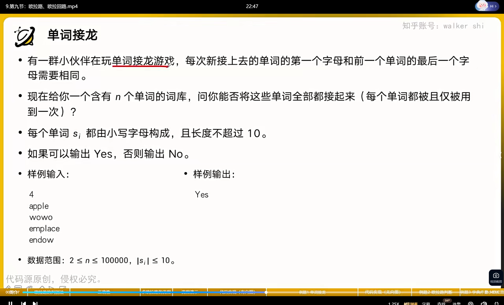
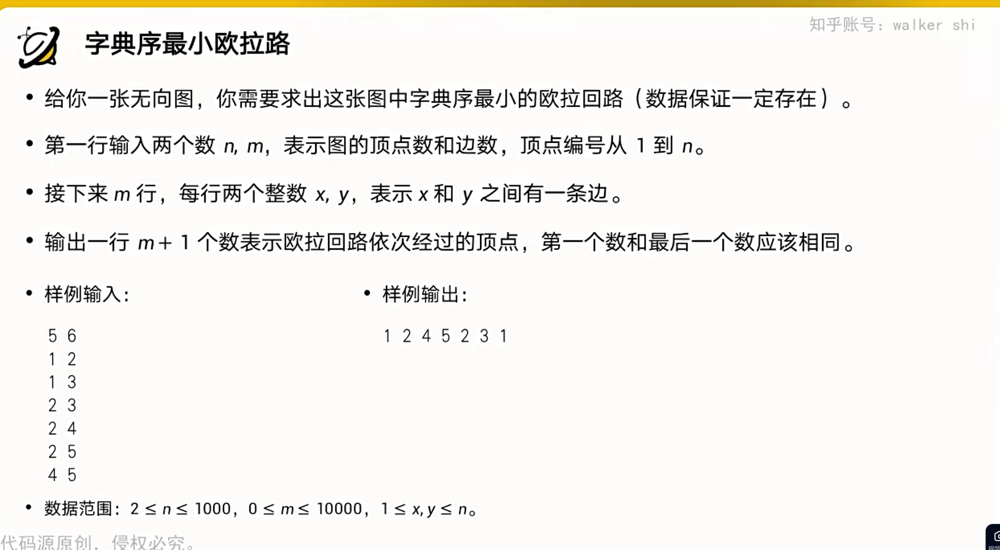

# 欧拉路

## 有向图



```cpp
#include <bits/stdc++.h>

using namespace std;

vector<int> edge[27];
int n, m, l, f[27], c[100002], ind[27], outd[27];

inline void dfs(int x)
{
    
    while (f[x] < outd[x])
    {
        int y = edge[x][f[x]];
        ++f[x];
        dfs(y);
        c[++l] = y;
    }
}

inline void Euler()
{
    int x = 0, y = 0, z = 0; // x是欧拉路起始点,y是出度比入度大1,z是入度和出度不相等点的数量
    for (int i = 1; i <= n; i++)
    {
        if (outd[i] == ind[i] + 1)
        {
            y++, x = i;
        }
        if (outd[i] != ind[i])
        {
            z++;
        }
    }
    if (!(!z || (y == 1 && z == 2)))
    {
        printf("No\n");
        return;
    }

    if (!x)
    {
        for (int i = 1; i <= n; i++)
            if (ind[i])
                x = i;
    }
    memset(f, 0, sizeof(f));
    l = 0;
    dfs(x);
    c[++l] = x;
    if (l == m + 1)
    {
        printf("Yes\n");
    }
    else
    {
        printf("No\n");
    }
}

int main()
{
    n = 26;
    scanf("%d", &m);
    for (int i = 1; i <= m; i++)
    {
        char str[101];
        scanf("%s", str);
        int x = str[0] - 'a' + 1, y = str[strlen(str) - 1] - 'a' + 1;
        edge[x].push_back(y);
        ++outd[x], ++ind[y];
    }
    Euler();
}

/*
4
apple
wowo
emplace
endow
Yes


*/
```

## 无向图

### 习题一


```cpp
#include<bits/stdc++.h>

using namespace std;

struct Node{
    int y,idx;
    Node(int _y,int _idx){
        y=_y;
        idx = _idx;
    }
};
vector <Node> edge[100001];
int n,m,cnt=1,l,f[100001],c[100002],d[100001];
bool b[200002];

inline void dfs(int x){
    while(f[x]<d[x]){
        int y = edge[x][f[x]].y, idx = edge[x][f[x]].idx;
        if(!b[idx]){
            ++f[x];
            b[idx]=b[idx^1]=true;
            dfs(y);
            c[++l] = y;
        }else
            ++f[x];
    }
}

inline void Euler(){
    int x = 0, y = 0;//x记录起点位置,y记录奇数结点个数
    for(int i=1;i<=n;i++){
        if(d[i]&1){//判断是否为奇数
            ++y, x = i;
        }
    }
    if(y&&y!=2){
        printf("No\n");
        return;
    }
    if(!x){
        for (int i = 1; i <= n;i++){
            if(d[i])
                x = i;
        }
    }
    memset(b,false,sizeof(b));
    memset(f, 0, sizeof(f));
    l=0;
    dfs(x);
    c[++l]=x;
    if(l!=m+1){
        printf("No\n");
        return;
    }
    printf("Yes\n");
}


int main(){
    scanf("%d%d",&n,&m);
    for (int i = 1;i<=m;i++){
        int x,y;
        scanf("%d%d", &x, &y);
        edge[x].push_back(Node(y,++cnt));
        edge[y].push_back(Node(x, ++cnt));
        ++d[x], ++d[y];
    }
    Euler();
}

```

### 习题二



```cpp
#include<bits/stdc++.h>

using namespace std;

struct Node{
    int y,idx;
    Node(int _y,int _idx){
        y=_y;
        idx = _idx;
    }
    bool operator < (const Node &A) const{
        return y < A.y;
    }
};
vector <Node> edge[1001];
int n,m,cnt=1,l,f[1001],c[10002],d[1001];
bool b[20002];

inline void dfs(int x){
    while(f[x]<d[x]){
        int y = edge[x][f[x]].y, idx = edge[x][f[x]].idx;
        if(!b[idx]){
            ++f[x];
            b[idx]=b[idx^1]=true;
            dfs(y);
            c[++l] = y;
        }else
            ++f[x];
    }
}

inline void Euler(){
    int x = 0;
        for (int i = 1; i <= n;i++){
            if(d[i]){
                x = i;
                break;
            }
                
        }
    memset(b,false,sizeof(b));
    memset(f, 0, sizeof(f));
    l=0;
    dfs(x);
    c[++l]=x;
    for (int i = l;i;i--){
        printf("%d ", c[i]);
    }
}


int main(){
    scanf("%d%d",&n,&m);
    for (int i = 1;i<=m;i++){
        int x,y;
        scanf("%d%d", &x, &y);
        edge[x].push_back(Node(y,++cnt));
        edge[y].push_back(Node(x, ++cnt));
        ++d[x], ++d[y];
    }
    for(int i=1;i<=n;i++){
        sort(edge[i].begin(), edge[i].end());
    }
    Euler();
}

/*

5 6
1 2
1 3
2 3
2 4
2 5
4 5
*/
```

