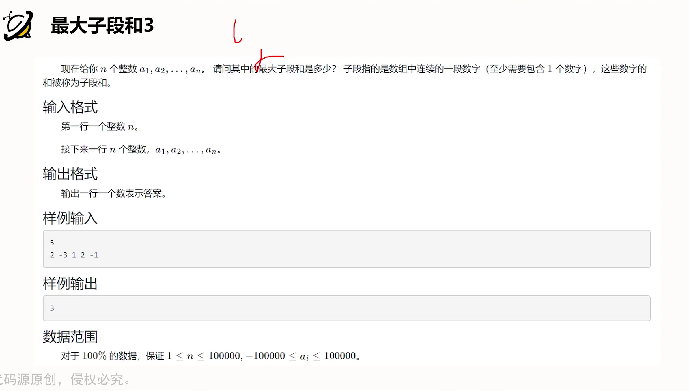
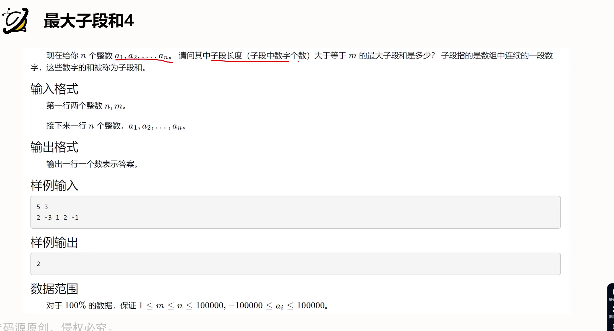

# 高精度
## 高精度加法

```cpp
#include <iostream>
#include<vector>

using namespace std;

vector<int> add(vector<int> &A,vector<int>&B){
    vector<int> C;
    int t=0;
    for (int i = 0; i < A.size() || i < B.size();i++){
        if(i<A.size()) t+=A[i];
        if(i<B.size()) t+=B[i];
        C.push_back(t%10);
        t /= 10;
    }
    if(t) C.push_back(t);
    return C;
}

int main(){
    string a,b;
    cin >> a >> b;
    vector<int> A, B;
    for (int i = a.size() - 1;i>=0;i--)  A.push_back(a[i]-'0');
    for (int i = b.size() - 1;i>=0;i--)  B.push_back(b[i]-'0');
    auto C=add(A,B);
    for (int i = C.size() - 1;i>=0;i--) printf("%d",C[i]);
}
```

## 高精度减法

```cpp
#include <iostream>
#include<vector>

using namespace std;

bool cmp(vector<int> &A,vector<int>&B){
        if(A.size()!=B.size()) return A.size()>B.size();
        for (int i = A.size() - 1;i>=0;i--){
            if(A[i]!=B[i])  return A[i]>B[i];
        }
        return true;
}

vector<int> sub(vector<int> &A,vector<int>&B){
    vector<int> C;
    for (int i = 0,t=0; i < A.size() ;i++){
           t=A[i]-t;
           if(i<B.size())  t-=B[i];
           C.push_back((t+10)%10);
           if(t<0)  t=1;
           else t=0;
    }
    while(C.size()>1&&C.back()==0)  C.pop_back();
    return C;
 }

int main(){
    string a,b;
    cin >> a >> b;
    vector<int> A, B;
    for (int i = a.size() - 1;i>=0;i--)  A.push_back(a[i]-'0');
    for (int i = b.size() - 1;i>=0;i--)  B.push_back(b[i]-'0');
    
    if(cmp(A,B)){
        auto C=sub(A,B);
        for (int i = C.size() - 1; i >= 0;i--) printf("%d",C[i]);
    }else{
        auto C=sub(B,A);
        printf("-");
         for (int i = C.size() - 1; i >= 0;i--) printf("%d",C[i]);
    }
}
```

## 高精度乘法

```cpp
#include<iostream>
#include<vector>

using namespace std;

vector<int> mul(vector<int> &A,int b){
  vector<int> C;

  int t=0;
  for (int i = 0; i < A.size() || t;i++){
    if(i<A.size())  t+=A[i]*b;
    C.push_back(t%10);
    t /= 10;
  }
  return C;
}
int main(){
  string a;
  int b;
  cin >> a >> b;

  vector<int>A;
  for (int i = a.size() - 1; i >= 0;i--)  A.push_back(a[i]-'0');
  auto C=mul(A,b);
  for (int i = C.size() - 1;i>=0;i--)  printf("%d",C[i]);
}
```

## 高精度除法

```cpp
#include<iostream>
#include<vector>
#include<algorithm>

using namespace std;

vector<int> div (vector<int> &A,int b,int &r){
  vector<int > C;
  r=0;
  for (int i = A.size() - 1;i>=0;i--){
    r=r*10+A[i];
    C.push_back(r/b);
    r %= b;
  }
  reverse(C.begin(),C.end());
  while(C.size()>1&&C.back()==0)  C.pop_back();
  return C;
}

int main(){
  string a;
  int b;
  cin >> a >> b;
  vector<int> A;
  for (int i = a.size() - 1;i>=0;i--) A.push_back(a[i]-'0');
  int r;
  auto C=div(A,b,r);
  for (int i = C.size() - 1;i>=0;i--) printf("%d",C[i]);
  cout << endl << r << endl;
}
```

# 前缀和
## 一维前缀和

```cpp
#include<iostream>

using namespace std;
const int N=10010;
int n,m;
int a[N],s[N];

int main(){
  scanf("%d%d",&n,&m);
  for(int i=1;i<=n;i++)  scanf("%d",&a[i]);

  for(int i=1;i<=n;i++)  s[i]=s[i-1]+a[i];
  while(m--){
    int l,r;
    scanf("%d%d",&l,&r);
    printf("%d\n", s[r] - s[l - 1]);
  }
  return 0;
}

```

## 子矩阵的和

```cpp
#include<iostream>

const int N=1010;
int n, m, q;
int a[N][N],s[N][N];
int main(){
    scanf("%d%d%d",&n,&m,&q);
    for(int i=1;i<=n;i++){
        for(int j=1;j<=m;j++){
            scanf("%d",&a[i][j]);
        }
    }
    for(int i=1;i<=n;i++){
        for (int j = 1;j<=m;j++){
            s[i][j] = s[i - 1][j] + s[i][j - 1] + a[i][j] - s[i - 1][j - 1];
        }
    }
    while(q--){
        int x1,y1,x2,y2;
        scanf("%d%d%d%d",&x1,&y1,&x2,&y2);
        printf("%d\n", s[x2][y2] - s[x1 - 1][y2] - s[x2][y1 - 1] + s[x1 - 1][y1 - 1]);
    }
    return 0;
}
```
# 前缀和习题

## 最大子段和





```cpp
#include <bits/stdc++.h>

using namespace std;

int n, a[200001];
long long s[100001];
int main()
{
    scanf("%d", &n);
    for (int i = 1; i <= n; i++)
    {
        scanf("%d", &a[i]);
    }
    for (int i = 1; i <= n; i++)
    {
        s[i] = s[i - 1] + a[i];
    }
    long long ans = -1LL<<60LL;
    long long x = 0;
    for (int i = 1; i <= n; i++)
    {
        ans = max(ans, s[i] - x);
        x = min(x, s[i]);//这一行和上一行不能颠倒(全为负数的情况)
    }
    printf("%lld", ans);
}

```

思维扩展

```cpp
#include <bits/stdc++.h>

using namespace std;
int n, a, b,ans=INT_MIN;
int main()
{
    scanf("%d", &n);
    for (int i = 1; i <= n; i++)
    {
        scanf("%d", &a);
        if (i == 1)
            b = a;
        else
            b = max(a, a + b);
        ans = max(ans, b);
    }
    printf("%d", ans);
}
```


## 子段和加强版





```cpp
#include<bits/stdc++.h>

using namespace std;

int n,m,a[100001];
long long s[100001],t[100001];

int main(){
    scanf("%d%d",&n,&m);
    for(int i=1;i<=n;i++){
        scanf("%d", &a[i]);
    }
    for(int i=1;i<=n;i++){
        s[i] = s[i - 1] + a[i];
    }
    for (int i = 1;i<=n;i++){
        t[i] = min(s[i], t[i - 1]);
    }
    long long ans=-1LL<<60LL;
    for(int i=m;i<=n;i++){
        ans = max(ans, s[i] - t[i - m]);
    }
    printf("%lld", ans);
}
```


# 差分

## 一维差分

```cpp
#include<iostream>

using namespace std;

const int N=10010;

int n,m;
int a[N],b[N];
void insert(int l,int r,int c){
    b[l]+=c;
    b[r + 1] -= c;
}
int main(){
  scanf("%d%d",&n,&m);
  for (int i = 1; i <= n;i++) scanf("%d",&a[i]);
  for (int i = 1; i <= n;i++)  insert(i,i,a[i]);

  while(m--){
    int l,r,c;
    scanf("%d%d%d",&l,&r,&c);
    insert(l, r, c);
  }
  for(int i=1;i<=n;i++)   b[i]+=b[i-1];
  for (int i = 1; i <= n;i++) printf("%d ",b[i]);//此时b[i]=a[i]
  return 0;
}
```


## 矩阵差分

```cpp
#include<iostream>

using namespace std;
const int N=1010;

int n,m,q;
int a[N][N],b[N][N];

void insert(int x1,int y1 ,int x2 ,int y2,int c){
    b[x1][y1]+=c;
    b[x2+1][y1]-=c;
    b[x1][y2+1]-=c;
    b[x2+1][y2+1]+=c;
}
int main(){
    scanf("%d%d%d",&n,&m,&q);
    for(int i=1;i<=n;i++){
        for(int j=1;j<=m;j++){
            scanf("%d", &a[i][j]);
        }
    }
    for (int i = 1; i <= n; i++)
    {
        for (int j = 1; j <= m; j++)
        {
            insert(i, j, i, j, a[i][j]);
        }
    }
    while(q--){
        int x1,y1,x2,y2,c;
        cin >> x1>>y1>>x2>>y2>>c;
        insert(x1, y1, x2, y2, c);
    }
    for (int i = 1; i <= n; i++)
    {
        for (int j = 1; j <= m; j++)
        {
            b[i][j] += b[i - 1][j] + b[i][j - 1] - b[i - 1][j - 1];
        }
    }
    for (int i = 1; i <= n; i++)
    {
        for (int j = 1; j <= m; j++)
        {
            printf("%d ", b[i][j]);
        }
        puts("");
    }
}
    
```

